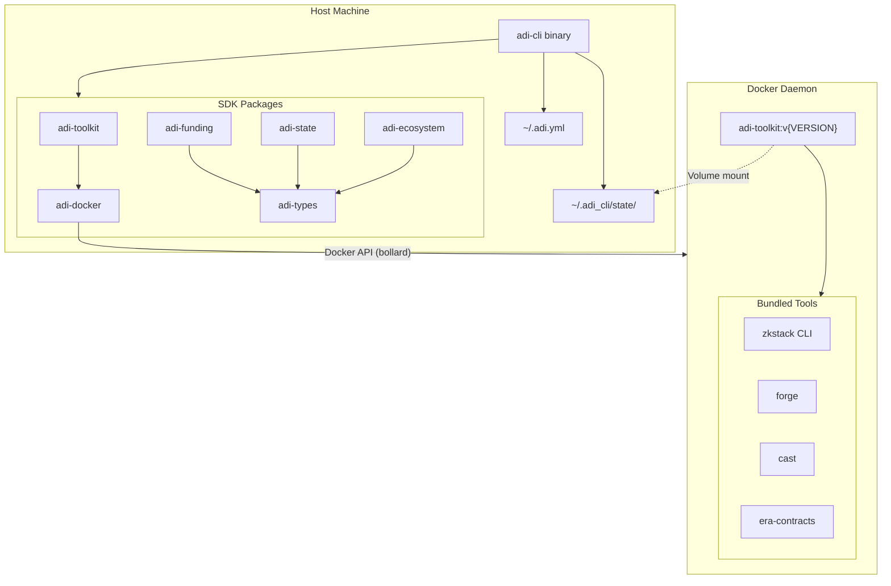

# adi-cli

[](https://www.rust-lang.org/)
[](https://www.docker.com/)

**adi-cli** is an SDK-first Rust CLI for managing ZkSync ecosystem smart contracts. Rather than embedding all logic in a monolithic binary, adi-cli separates concerns into reusable library crates while the CLI itself acts as an orchestrator. The tool runs on your host machine and uses Docker to execute zkstack, foundry-zksync, and era-contracts within pre-built toolkit containers, ensuring reproducible and isolated environments across different machines and operating systems.

## Table of Contents

- [Features](#features)
- [Architecture](#architecture)
- [Prerequisites](#prerequisites)
- [Installation](#installation)
- [Configuration](#configuration)
- [Usage Guide](#usage-guide)
- [State Management](#state-management)
- [Docker Architecture](#docker-architecture)
- [Development](#development)

## Features

### SDK-first Design

The core logic lives in 6 independent library crates that can be imported and used programmatically. This means you can build your own tooling on top of the same battle-tested code that powers the CLI, or integrate ecosystem management into larger automation pipelines.

### Docker Orchestration

All blockchain tooling (zkstack, forge, cast, era-contracts) runs inside versioned Docker containers. This eliminates "works on my machine" problems by ensuring everyone uses identical tool versions. The CLI automatically pulls the correct toolkit image based on your specified protocol version.

### Multi-network Support

Deploy your ecosystem to any supported network: use `localhost` with Anvil for rapid local development, `sepolia` for testnet validation, or `mainnet` for production deployment. The CLI handles network-specific configurations automatically.

### Plan-then-Execute Funding

Before transferring any funds, the CLI shows you exactly what will happen. The dry-run mode displays which wallets will receive how much ETH, allowing you to verify the funding plan before committing real transactions.

### Abstract State Backend

Ecosystem state is stored in a structured format with a pluggable backend system. The default filesystem backend uses YAML files, but the architecture supports adding database backends in the future without changing the CLI interface.

### Ownership Management

ZkSync ecosystem contracts use the Ownable2Step pattern for secure ownership transfers. The CLI automates the acceptance of pending ownership transfers across multiple contracts, handling different acceptance methods (direct calls, multicall, governance scheduling) transparently.

### Custom Gas Token Support

Configure your chain to use any ERC20 token as the base token for gas payments, with configurable price ratios. By default, chains use native ETH.

## Architecture

The following diagram shows how adi-cli orchestrates ecosystem deployment. The CLI binary runs on your host machine, reading configuration from `~/.adi.yml` and persisting state to `~/.adi_cli/state/`. When operations require blockchain tooling, the CLI communicates with the Docker daemon via the bollard crate to spin up ephemeral toolkit containers. These containers mount the state directory, execute the required operations (like running zkstack or forge commands), and are automatically removed when complete.



### Package Responsibilities

**adi-types** serves as the foundation layer, providing shared domain types used across all other packages. Types like `L1Network`, `Wallet`, `EcosystemMetadata`, and `ChainContracts` are defined here to ensure consistency. Having no internal dependencies makes it the stable base that other packages can safely import.

**adi-docker** is a pure Docker SDK built on the bollard crate. It handles low-level container operations: connecting to the Docker daemon, pulling images, creating and starting containers, streaming output, and cleanup. This package knows nothing about ZkSync—it's a generic Docker orchestration layer.

**adi-toolkit** sits above adi-docker and adds protocol awareness. It knows about toolkit image naming conventions, protocol versions, and how to construct the right container configurations for running zkstack, forge, or cast commands. When you specify `--protocol-version v30.0.2`, this package translates that into the correct Docker image tag.

**adi-ecosystem** contains domain logic for ZkSync ecosystem management. Importantly, it has no Docker dependencies—all operations are expressed as data transformations and command-line argument builders. This separation means the ecosystem logic can be tested without containers and reused in contexts where Docker isn't available.

**adi-state** manages persistent storage through an abstract backend interface. The `StateBackend` trait defines operations like reading and writing ecosystem metadata, wallet information, and contract addresses. The default `FilesystemBackend` serializes everything to YAML files, but the trait-based design allows swapping in a database backend later.

**adi-funding** handles wallet funding with a plan-then-execute pattern. It builds a funding plan by checking current balances and calculating required transfers, presents this plan for review, and only executes when confirmed. This package also includes Anvil auto-detection for seamless local development.

## Prerequisites

### Required

**Rust (2021 edition)** — Install via [rustup](https://rustup.rs/):
```bash
curl --proto '=https' --tlsv1.2 -sSf https://sh.rustup.rs | sh
```

**Docker** — Must be installed and running. The CLI communicates with the Docker daemon to pull and run toolkit containers. Verify Docker is working:
```bash
docker ps
```

**Protocol genesis.json** — Each protocol version has an associated genesis file that defines the initial state of your ecosystem. You must download this file before initializing an ecosystem.

To obtain the genesis file:
1. Identify your target protocol version (e.g., `v30.0.2`)
2. Download the corresponding genesis.json from the ZkSync protocol releases
3. Place it in your state directory: `~/.adi_cli/state/genesis.json`

```bash
mkdir -p ~/.adi_cli/state

# Download genesis.json for protocol v30.0.2
curl -o ~/.adi_cli/state/genesis.json \
  https://raw.githubusercontent.com/matter-labs/zksync-os-server/48650acecd1182c56c0f6d86f3c471f8d72159c6/genesis/genesis.json
```

### Optional

**[Task](https://taskfile.dev/)** — A task runner that provides convenient shortcuts for common operations. Install if you prefer running `task build` instead of `cargo build`.

## Installation

### Building from Source

Clone the repository and build the release binary:

```bash
git clone <repository-url>
cd adi-cli

# Build optimized release binary (LTO enabled, ~60 seconds)
cargo build --release

# The binary is at ./target/release/adi
# Optionally copy to a directory in your PATH
cp ./target/release/adi ~/.local/bin/
```

### Using Task

If you have Task installed:

```bash
task build           # Development build (faster compilation)
task build:release   # Optimized release build
```

### Verifying Installation

Confirm the CLI is working:

```bash
adi show version
```

You should see the version number and git commit hash.

## Configuration

The CLI loads configuration from multiple sources, merged in the following order (later sources override earlier ones):

1. **Built-in defaults** — Sensible starting values
2. **Config file** (`~/.adi.yml`) — Your persistent settings
3. **`ADI_CONFIG` environment variable** — Alternative config file path
4. **`--config` flag** — Override config file for this invocation
5. **`ADI__*` environment variables** — Override individual settings
6. **CLI flags** — Highest priority, per-command overrides

### Configuration File

Create `~/.adi.yml` with your ecosystem settings. Below is a complete example with explanations:

```yaml
# ~/.adi.yml

# Where to store ecosystem state (wallets, contracts, chain configs)
# Default: ~/.adi_cli/state
state_dir: ~/.adi_cli/state

# Enable verbose logging for troubleshooting
# Default: false (can also use -d flag)
debug: false

# State storage backend (currently only "filesystem" is supported)
# Default: filesystem
state_backend: filesystem

# Default values for ecosystem initialization
# These are used when CLI flags are not provided
ecosystem:
  # Name used for the ecosystem directory and identification
  name: my-ecosystem

  # Settlement layer network where contracts are deployed
  # Options: localhost (Anvil), sepolia (testnet), mainnet
  l1_network: sepolia

  # Name of the initial ZK chain within this ecosystem
  chain_name: my-chain

  # Unique numeric identifier for the chain
  # Must not conflict with other chains
  chain_id: 271

  # Proof generation mode
  # no-proofs: Development/testing (fast, no real proofs)
  # gpu: Production (requires GPU prover infrastructure)
  prover_mode: no-proofs

  # OPTIONAL: Custom ERC20 token for gas payments
  # Omit this section to use native ETH (default)
  # base_token_address: "0x2a98B46fe31BA8Be05ef1cE3D36e1f80Db04190D"
  # base_token_price_nominator: 1
  # base_token_price_denominator: 1

  # Enable EVM bytecode emulator for running unmodified Ethereum contracts
  # Default: false
  evm_emulator: false

# Default values for wallet funding during deployment
funding:
  # RPC endpoint for the settlement layer
  # For Anvil (local): http://host.docker.internal:8545
  # For Sepolia: https://sepolia.infura.io/v3/YOUR_KEY
  rpc_url: https://sepolia.infura.io/v3/YOUR_KEY

  # SECURITY: Use ADI_FUNDER_KEY environment variable instead
  # Never commit private keys to config files
  # funder_key: "0x..."

  # Buffer added to estimated gas prices (percentage)
  # Recommended: 200 for Anvil, 300 for Sepolia
  # Default: 120
  gas_multiplier: 300

  # ETH amounts to send to each wallet role (in ether)
  #
  # For Sepolia TESTING (short-term, minimal funding):
  #   deployer_eth: 1.0
  #   governor_eth: 1.0
  #   governor_cgt_units: 5.0
  #   operator_eth: 0.5
  #   prove_operator_eth: 0.5
  #   execute_operator_eth: 0.5
  #
  # For PRODUCTION or long-running chains (values below):
  deployer_eth: 1.0           # Deploys contracts
  governor_eth: 1.0           # Governance operations
  governor_cgt_units: 5.0     # Custom gas token (if using custom base token)
  operator_eth: 5.0           # Commits batches
  prove_operator_eth: 5.0     # Submits proofs
  execute_operator_eth: 5.0   # Executes batches

# OPTIONAL: Override Docker toolkit image settings
# toolkit:
#   # Use a custom image tag instead of protocol version-derived tag
#   image_tag: "latest"
```

### Environment Variables

For sensitive data like private keys, use environment variables instead of config files:

| Variable                   | Purpose                                                                                                          |
| -------------------------- | ---------------------------------------------------------------------------------------------------------------- |
| `ADI_FUNDER_KEY`           | Private key (hex) of the wallet that funds ecosystem wallets. This is the only wallet you need to fund manually. |
| `ADI_RPC_URL`              | Settlement layer RPC endpoint. Useful for switching networks without editing config.                             |
| `ADI_CONFIG`               | Path to an alternative config file.                                                                              |
| `ADI__TOOLKIT__IMAGE_TAG`  | Override Docker image tag for toolkit containers (e.g., `latest` or `custom-build`).                             |
| `RUST_LOG`                 | Logging verbosity: `error`, `warn`, `info`, `debug`, `trace`                                                     |

You can also override any config value using the `ADI__` prefix with double underscores as path separators:

```bash
# Override ecosystem name
export ADI__ECOSYSTEM__NAME=production

# Override funding RPC URL
export ADI__FUNDING__RPC_URL=http://localhost:8545
```

## Usage Guide

This section walks through the complete workflow for deploying a ZkSync ecosystem, from initialization through ownership acceptance.

### Step 1: Verify Your Setup

Before starting, confirm the CLI can read your configuration and connect to Docker:

```bash
# Check CLI version and build info
adi show version

# Display merged configuration from all sources
adi show config
```

The `show config` command is particularly useful for debugging configuration issues. It displays the final merged configuration, showing you exactly what values the CLI will use.

### Step 2: Initialize Your Ecosystem

The `init ecosystem` command creates the foundational configuration for your ZkSync ecosystem. This includes generating wallet keys, creating metadata files, and setting up the initial chain configuration.

**What this command does:**
1. Validates the protocol version
2. Connects to Docker and pulls the toolkit image if needed
3. Runs zkstack inside a container to generate ecosystem files
4. Imports the generated state into your state directory
5. Generates cryptographic keys for all ecosystem wallets

**Required argument:**
- `--protocol-version, -p` — The ZkSync protocol version (e.g., `v30.0.2`). This determines which toolkit image to use and ensures compatibility.

**Common optional arguments:**

| Flag               | Description                                            |
| ------------------ | ------------------------------------------------------ |
| `--ecosystem-name` | Override the ecosystem name from config                |
| `--l1-network`     | Settlement layer: `localhost`, `sepolia`, or `mainnet` |
| `--chain-name`     | Name for the initial chain                             |
| `--chain-id`       | Unique numeric chain identifier                        |
| `--prover-mode`    | `no-proofs` for testing, `gpu` for production          |

**Example: Local development ecosystem**

```bash
adi init ecosystem \
  --protocol-version v30.0.2 \
  --ecosystem-name dev-ecosystem \
  --l1-network localhost \
  --chain-name dev-chain \
  --chain-id 270 \
  --prover-mode no-proofs
```

**Example: Testnet ecosystem**

```bash
adi init ecosystem \
  --protocol-version v30.0.2 \
  --ecosystem-name testnet-ecosystem \
  --l1-network sepolia \
  --chain-name testnet-chain \
  --chain-id 271
```

After initialization, check `~/.adi_cli/state/<ecosystem-name>/` to see the generated files, including `configs/wallets.yaml` with your new wallet addresses.

### Step 3: Deploy Ecosystem Contracts

The `deploy ecosystem` command funds your ecosystem wallets and deploys the smart contracts to the settlement layer. This is a two-phase process: funding and deployment.

**Funding phase:**
The CLI calculates how much ETH each wallet needs, checks current balances, and transfers funds from your funder wallet. Before any transfers occur, you'll see a summary of the funding plan.

**Deployment phase:**
After funding, the CLI runs zkstack inside a container to deploy ecosystem contracts (Bridgehub, Governance, StateTransitionManager, etc.) to the settlement layer.

**Wallet roles explained:**

| Role             | Purpose                                     | Typical Funding |
| ---------------- | ------------------------------------------- | --------------- |
| Deployer         | Deploys all smart contracts                 | 1-2 ETH         |
| Governor         | Executes governance operations and upgrades | 1-2 ETH         |
| Operator         | Commits transaction batches to L1           | 5+ ETH          |
| Prove Operator   | Submits validity proofs                     | 5+ ETH          |
| Execute Operator | Executes verified batches                   | 5+ ETH          |

**Recommended workflow:**

Always start with a dry-run to see what will happen:

```bash
# Preview the funding plan without executing
adi deploy ecosystem -p v30.0.2 --dry-run
```

Once you've verified the plan looks correct:

```bash
# Set your funder wallet private key
export ADI_FUNDER_KEY="0x..."

# Execute deployment (will prompt for confirmation)
adi deploy ecosystem -p v30.0.2
```

**Local development with Anvil:**

Anvil is a local Ethereum node for development. Install it from [Foundry](https://github.com/foundry-rs/foundry):

```bash
curl -L https://foundry.paradigm.xyz | bash
foundryup
```

Start Anvil with state persistence (recommended to preserve state between restarts):

```bash
anvil --state ~/.adi_cli/anvil-state
```

**Important:** Because the CLI runs blockchain tooling inside Docker containers, you must configure the RPC URL to use Docker's host networking. Create or update your `~/.adi.yml`:

```yaml
ecosystem:
  # Use sepolia for Docker network compatibility (not localhost)
  l1_network: sepolia

funding:
  # Docker containers access host machine via host.docker.internal
  rpc_url: http://host.docker.internal:8545

  # No funder_key needed - Anvil accounts are pre-funded
  # funder_key: not required

  # Higher gas multiplier recommended for Anvil
  gas_multiplier: 200
```

Then deploy:

```bash
adi deploy ecosystem -p v30.0.2
```

> **Note:** We use `l1_network: sepolia` even for local Anvil because Docker containers cannot access `localhost` directly. The `host.docker.internal` hostname routes traffic from the container to your host machine where Anvil is running.

**Skipping phases:**

```bash
# Only fund wallets, don't deploy contracts
adi deploy ecosystem -p v30.0.2 --skip-deployment

# Only deploy contracts (wallets already funded)
adi deploy ecosystem -p v30.0.2 --skip-funding
```

### Step 4: Accept Ownership Transfers

After deployment, some contracts have pending ownership transfers that must be accepted. ZkSync contracts use the Ownable2Step pattern: ownership isn't transferred in one transaction—instead, new ownership is proposed, then the new owner must accept.

The `accept ownership` command handles this for all ecosystem contracts, using the appropriate method for each:
- **Direct acceptance** — Calls `acceptOwnership()` directly
- **Multicall** — Batches multiple acceptances via ChainAdmin
- **Governance scheduling** — Uses the governance contract for time-locked operations

**Example workflow:**

```bash
# First, see which contracts have pending ownership
adi accept ownership --dry-run

# Accept ecosystem-level ownership
adi accept ownership --yes

# Also accept chain-level ownership
adi accept ownership --chain my-chain --yes
```

The output shows the status of each contract:
- **Pending** — Ownership transfer awaiting acceptance
- **Accepted** — Successfully accepted
- **Skipped** — Already owned correctly
- **Failed** — Acceptance failed (check logs)

## State Management

The CLI persists all ecosystem state in structured YAML files under `~/.adi_cli/state/`. Understanding this structure helps with debugging, backup, and manual inspection.

### Directory Structure

```
~/.adi_cli/state/
├── genesis.json                          # Protocol genesis (you provide this)
└── <ecosystem-name>/
    ├── ZkStack.yaml                      # Ecosystem metadata
    ├── genesis.json                      # Copy of genesis file
    ├── configs/
    │   ├── wallets.yaml                  # Ecosystem-level wallets
    │   ├── contracts.yaml                # Deployed contract addresses
    │   ├── initial_deployments.yaml      # Deployment configuration
    │   ├── erc20_deployments.yaml        # Token deployments
    │   └── apps.yaml                     # Explorer/portal configs
    └── chains/
        └── <chain-name>/
            ├── ZkStack.yaml              # Chain metadata
            └── configs/
                ├── wallets.yaml          # Chain-specific wallets
                ├── contracts.yaml        # Chain contract addresses
                ├── genesis.yaml          # Chain genesis config
                ├── general.yaml          # General settings
                └── secrets.yaml          # Sensitive chain data
```

### Key Files

**ZkStack.yaml** contains metadata about the ecosystem or chain: name, chain ID, prover mode, base token configuration, and paths to related files.

**wallets.yaml** stores wallet addresses and private keys. The ecosystem-level file contains deployer and governor wallets; chain-level files contain operator wallets. **Keep these files secure—they contain private keys.**

**contracts.yaml** appears after deployment, containing the addresses of all deployed contracts. This file is essential for interacting with your ecosystem programmatically.

**genesis.json** is the protocol genesis configuration. The CLI copies your provided genesis file into each ecosystem directory for reference.

## Docker Architecture

The CLI uses Docker to ensure reproducible execution of blockchain tooling. This section explains how the container orchestration works.

### Toolkit Images

Pre-built images contain all required tools for ecosystem management:

| Property        | Value                                       |
| --------------- | ------------------------------------------- |
| Registry        | `harbor.sde.adifoundation.ai/adi-chain/cli` |
| Image           | `adi-toolkit`                               |
| Tag format      | `v{MAJOR}.{MINOR}.{PATCH}`                  |
| Default timeout | 30 minutes                                  |

Full image reference example:
```
harbor.sde.adifoundation.ai/adi-chain/cli/adi-toolkit:v30.0.2
```

### What's in the Toolkit

Each toolkit image bundles:
- **zkstack** — ZkSync stack management CLI for creating and deploying ecosystems
- **forge** — Foundry's Solidity compiler for contract compilation
- **cast** — Foundry's EVM interaction tool for blockchain queries
- **era-contracts** — ZkSync smart contract sources and upgrade scripts

### Container Lifecycle

When the CLI needs to run a toolkit command:

1. **Image check** — Verifies the required image exists locally
2. **Auto-pull** — If missing, pulls from the registry (may take a few minutes first time)
3. **Container creation** — Creates an ephemeral container with your state directory mounted
4. **Execution** — Runs the command, streaming output to your terminal
5. **Cleanup** — Removes the container (state persists in mounted volume)

This ephemeral approach means containers don't accumulate—each operation starts fresh.

### Overriding the Image Tag

By default, the CLI determines the Docker image tag from the protocol version (e.g., `v30.0.2`). You can override this for testing custom builds or using special tags like `latest`.

**Priority order:** CLI flag > environment variable > config file > protocol version

**CLI flag (highest priority):**
```bash
adi --image-tag custom-tag init ecosystem -p v30.0.2
adi --image-tag latest deploy ecosystem -p v30.0.2
```

**Environment variable:**
```bash
export ADI__TOOLKIT__IMAGE_TAG=custom-tag
adi deploy ecosystem -p v30.0.2
```

**Config file (`~/.adi.yml`):**
```yaml
toolkit:
  image_tag: custom-tag
```

When an override is set, the CLI will use it instead of deriving the tag from the protocol version. This is useful for:
- Testing pre-release or development builds
- Using `latest` tag for always-current images
- Working with private registries that use different tagging schemes

### Building Custom Images

For development or custom tooling:

```bash
# Build the default toolkit image
task build:toolkit

# Build a specific version
task build:toolkit:v30.0.2

# Build for local testing only (faster, single platform)
task build:toolkit:local
```

## Development

### Building

```bash
# Development build (faster, includes debug symbols)
cargo build

# Release build (optimized, LTO, ~60 seconds)
cargo build --release

# Run without building separately
cargo run -- show version
```

### Testing

```bash
# Run all tests
cargo test --workspace

# Unit tests only (faster)
cargo test --workspace --lib

# Integration tests only
cargo test --workspace --test '*'
```

### Linting and Formatting

The project enforces strict code quality standards:

```bash
# Format code
cargo fmt

# Check formatting without modifying
cargo fmt -- --check

# Run clippy with strict rules
cargo clippy --workspace -- -D warnings
```

### Task Commands

If you have Task installed:

```bash
task build          # Development build
task build:release  # Release build
task test           # All tests
task test:unit      # Unit tests only
task lint           # Clippy linter
task fmt            # Format code
task check          # Run all checks (fmt, lint, test)
```

### Code Standards

The project enforces these rules via Clippy:

- **No panics** — Use `eyre::Result` with `wrap_err()` for error context
- **No unwrap/expect** — Always handle errors explicitly
- **No array indexing** — Use `.get()` methods to avoid panics
- **No wildcard imports** — Import items explicitly
- **Prefer borrowing** — Use `&str` over `String`, avoid unnecessary `.clone()`

### Exit Codes

| Code | Meaning                         |
| ---- | ------------------------------- |
| 0    | Success                         |
| 1    | Runtime error                   |
| 2    | Usage error (invalid arguments) |
