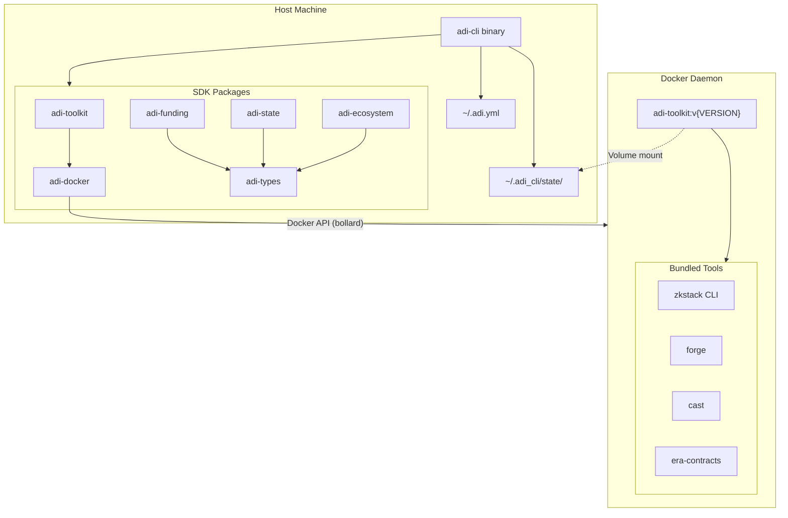

# adi-cli

[](https://www.rust-lang.org/)
[](https://www.docker.com/)

**adi-cli** is an SDK-first Rust CLI for managing ZkSync ecosystem smart contracts. Rather than embedding all logic in a monolithic binary, adi-cli separates concerns into reusable library crates while the CLI itself acts as an orchestrator. The tool runs on your host machine and uses Docker to execute zkstack, foundry-zksync, and era-contracts within pre-built toolkit containers, ensuring reproducible and isolated environments across different machines and operating systems.

## Table of Contents

- [Prerequisites](#prerequisites)
- [Installation](#installation)
- [Configuration](#configuration)
- [Usage Guide](#usage-guide)
- [State Management](#state-management)
- [Docker Architecture](#docker-architecture)
- [Architecture](#architecture)
- [Features](#features)
- [Development](#development)

## Prerequisites

- **Rust** — [Install via rustup](https://rustup.rs/)
- **Docker** — [Install Docker](https://www.docker.com/get-started/)

## Installation

```bash
CARGO_NET_GIT_FETCH_WITH_CLI=true cargo install --git ssh://git@gitlab.sre.ideasoft.io/adi-foundation/adi-chain/cli.git
```

Verify installation:

```bash
adi version
```

### Building from Source

```bash
git clone ssh://git@gitlab.sre.ideasoft.io/adi-foundation/adi-chain/cli.git adi-cli
cd adi-cli
cargo build --release
cp ./target/release/adi ~/.local/bin/
```

## Configuration

The CLI loads configuration from multiple sources, merged in the following order (later sources override earlier ones):

1. **Built-in defaults** — Sensible starting values
2. **Config file** (`~/.adi.yml`) — Your persistent settings
3. **`ADI_CONFIG` environment variable** — Alternative config file path
4. **`--config` flag** — Override config file for this invocation
5. **`ADI__*` environment variables** — Override individual settings
6. **CLI flags** — Highest priority, per-command overrides

### Configuration File

Create `~/.adi.yml` with your ecosystem settings. Below is a complete example with explanations:

```yaml
# ~/.adi.yml

# Where to store ecosystem state (wallets, contracts, chain configs)
# Default: ~/.adi_cli/state
state_dir: ~/.adi_cli/state

# Enable verbose logging for troubleshooting
# Default: false (can also use -d flag)
debug: false

# Default protocol version for toolkit Docker image
# Used by init, add, and deploy when --protocol-version is not provided
protocol_version: v0.30.1

# State storage backend (currently only "filesystem" is supported)
# Default: filesystem
state_backend: filesystem

# Default values for ecosystem initialization
# These are used when CLI flags are not provided
ecosystem:
  # Name used for the ecosystem directory and identification
  name: my-ecosystem

  # Settlement layer network where contracts are deployed
  # Options: localhost (Anvil), sepolia (testnet), mainnet
  # Default: sepolia
  l1_network: sepolia

  # Name of the initial ZK chain within this ecosystem
  chain_name: my-chain

  # Unique numeric identifier for the chain
  # Must not conflict with other chains
  # Default: 222
  chain_id: 222

  # Proof generation mode
  # no-proofs: Development/testing (fast, no real proofs)
  # gpu: Production (requires GPU prover infrastructure)
  # Default: no-proofs
  prover_mode: no-proofs

  # OPTIONAL: Custom ERC20 token for gas payments
  # Omit this section to use native ETH (default)
  # base_token_address: "0x2a98B46fe31BA8Be05ef1cE3D36e1f80Db04190D"
  # base_token_price_nominator: 1
  # base_token_price_denominator: 1

  # Enable EVM bytecode emulator for running unmodified Ethereum contracts
  # Default: false
  evm_emulator: false

  # Deploy as L3 chain (settling on L2 instead of L1)
  # When enabled, blobs are disabled and calldata DA is used
  # Required for chains settling on ZKsync-based L2s
  # Default: true
  l3: true

  # Settlement layer RPC endpoint
  # For Anvil (local): http://host.docker.internal:8545
  # For Sepolia: https://sepolia.infura.io/v3/YOUR_KEY
  rpc_url: https://sepolia.infura.io/v3/YOUR_KEY

# Default values for wallet funding during deployment
funding:
  # SECURITY: Use ADI_FUNDER_KEY environment variable instead
  # Never commit private keys to config files
  # funder_key: "0x..."

  # ETH amounts to send to each wallet role (in ether)
  #
  # For Sepolia TESTING (short-term, minimal funding):
  #   deployer_eth: 1.0
  #   governor_eth: 1.0
  #   governor_cgt_units: 5.0
  #   operator_eth: 0.5
  #   prove_operator_eth: 0.5
  #   execute_operator_eth: 0.5
  #
  # For PRODUCTION or long-running chains (values below):
  deployer_eth: 100.0         # Deploys contracts
  governor_eth: 40.0          # Governance operations
  governor_cgt_units: 5.0     # Custom gas token (if using custom base token)
  operator_eth: 30.0          # Commits batches
  prove_operator_eth: 30.0    # Submits proofs
  execute_operator_eth: 30.0  # Executes batches

# Default values for ownership operations
ownership:
  # Address to transfer ownership to after accepting
  # Can be overridden with --new-owner flag
  new_owner: "0x..."

  # SECURITY: Use ADI_PRIVATE_KEY environment variable instead
  # Private key for accepting ownership (new owner mode)
  # Can be overridden with --private-key flag or ADI_PRIVATE_KEY env var
  # private_key: "0x..."

# Gas price multiplier percentage (default: 200 = 100% buffer).
# Applied to all on-chain transactions (deploy, accept, transfer).
# The CLI fetches current gas price and multiplies by this percentage.
# Example: 200 means use 200% of estimated gas price (100% buffer).
# Recommended: 200 for Anvil, 300 for Sepolia/mainnet.
gas_multiplier: 200

# OPTIONAL: S3 synchronization for state backup and sharing
# When enabled, ecosystem state is automatically synced to S3 after changes
# s3:
#   # Enable S3 synchronization
#   # Default: false
#   enabled: true
#
#   # Tenant identifier - used as S3 key prefix (subfolder name)
#   # Required when S3 is enabled
#   # Example: "alice" → archives stored at "alice/ecosystem-name.tar.gz"
#   tenant_id: my-tenant
#
#   # S3 bucket name
#   # Default: adi-state
#   bucket: adi-state
#
#   # AWS region
#   # Default: us-east-1
#   region: us-east-1
#
#   # Custom S3 endpoint for S3-compatible services (MinIO, LocalStack)
#   # Omit for AWS S3
#   # endpoint_url: http://localhost:9000
#
#   # SECURITY: Use environment variables instead of storing in config
#   # access_key_id: ...
#   # secret_access_key: ...

# OPTIONAL: Override Docker toolkit image settings
# toolkit:
#   # Use a custom image tag instead of protocol version-derived tag
#   image_tag: "latest"

# OPTIONAL: Predefined operator addresses for validator role assignment
# Use this to assign validator roles to externally managed addresses during deploy.
# When specified, roles are revoked from default wallet operators and granted
# to these addresses instead. Operators manage their own private keys externally.
# operators:
#   operator: "0x..."         # PRECOMMITTER, COMMITTER, REVERTER roles
#   prove_operator: "0x..."   # PROVER role
#   execute_operator: "0x..." # EXECUTOR role
```

### Environment Variables

For sensitive data like private keys, use environment variables instead of config files:

| Variable                   | Purpose                                                                                                          |
| -------------------------- | ---------------------------------------------------------------------------------------------------------------- |
| `ADI_FUNDER_KEY`           | Private key (hex) of the wallet that funds ecosystem wallets. This is the only wallet you need to fund manually. |
| `ADI_PRIVATE_KEY`          | Private key (hex) for accepting ownership as new owner. Used by the `accept` command.                            |
| `ADI_RPC_URL`              | Settlement layer RPC endpoint. Useful for switching networks without editing config.                             |
| `ADI_EXPLORER_URL`         | Block explorer API URL for contract verification during deploy and scan commands.                                |
| `ADI_EXPLORER_API_KEY`     | Block explorer API key for contract verification (optional for public explorers).                                |
| `ADI_CONFIG`               | Path to an alternative config file.                                                                              |
| `ADI__PROTOCOL_VERSION`    | Default protocol version for init, add, and deploy commands (e.g., `v0.30.1`).                                   |
| `ADI__TOOLKIT__IMAGE_TAG`  | Override Docker image tag for toolkit containers (e.g., `latest` or `custom-build`).                             |
| `ADI_OPERATOR`             | Operator address for init (receives PRECOMMITTER, COMMITTER, REVERTER roles).                                    |
| `ADI_PROVE_OPERATOR`       | Prove operator address for init (receives PROVER role).                                                          |
| `ADI_EXECUTE_OPERATOR`     | Execute operator address for init (receives EXECUTOR role).                                                      |
| `AWS_ACCESS_KEY_ID`        | AWS access key for S3 synchronization.                                                                           |
| `AWS_SECRET_ACCESS_KEY`    | AWS secret key for S3 synchronization.                                                                           |
| `ADI__S3__ENABLED`         | Enable S3 sync (`true`/`false`).                                                                                 |
| `ADI__S3__TENANT_ID`       | Tenant identifier for S3 key prefix.                                                                             |
| `ADI__S3__BUCKET`          | S3 bucket name.                                                                                                  |
| `RUST_LOG`                 | Logging verbosity: `error`, `warn`, `info`, `debug`, `trace`                                                     |

You can also override any config value using the `ADI__` prefix with double underscores as path separators:

```bash
# Override ecosystem name
export ADI__ECOSYSTEM__NAME=production

# Override ecosystem RPC URL
export ADI__ECOSYSTEM__RPC_URL=http://localhost:8545
```

## Usage Guide

This section walks through the complete workflow for deploying a ZkSync ecosystem, from initialization through ownership acceptance.

### Step 1: Verify Your Setup

Before starting, confirm the CLI can read your configuration and connect to Docker:

```bash
# Check CLI version and build info
adi version

# Display merged configuration from all sources
adi config
```

The `config` command is particularly useful for debugging configuration issues. It displays the final merged configuration, showing you exactly what values the CLI will use.

### Step 2: Initialize Your Ecosystem

The `init` command creates the foundational configuration for your ZkSync ecosystem. This includes generating wallet keys, creating metadata files, and setting up the initial chain configuration.

**What this command does:**
1. Validates the protocol version
2. Connects to Docker and pulls the toolkit image if needed
3. Runs zkstack inside a container to generate ecosystem files
4. Imports the generated state into your state directory
5. Generates cryptographic keys for all ecosystem wallets

**All arguments are optional** and fall back to values in `~/.adi.yml`:

| Flag                     | Description                                            |
| ------------------------ | ------------------------------------------------------ |
| `--protocol-version`     | Protocol version (e.g., `v0.30.1`)                     |
| `--ecosystem-name`       | Override the ecosystem name from config                |
| `--l1-network`           | Settlement layer: `localhost`, `sepolia`, or `mainnet` |
| `--chain-name`           | Name for the initial chain                             |
| `--chain-id`             | Unique numeric chain identifier                        |
| `--prover-mode`          | `no-proofs` for testing, `gpu` for production          |
| `--operator`             | Operator address (PRECOMMITTER, COMMITTER, REVERTER)   |
| `--prove-operator`       | Prove operator address (PROVER role)                   |
| `--execute-operator`     | Execute operator address (EXECUTOR role)               |

**Example: Using config file defaults**

```bash
# With protocol_version set in ~/.adi.yml, no flags needed
adi init
```

**Example: Local development ecosystem**

```bash
adi init \
  --protocol-version v0.30.1 \
  --ecosystem-name dev-ecosystem \
  --l1-network localhost \
  --chain-name dev-chain \
  --chain-id 270 \
  --prover-mode no-proofs
```

**Example: Testnet ecosystem**

```bash
adi init \
  --protocol-version v0.30.1 \
  --ecosystem-name testnet-ecosystem \
  --l1-network sepolia \
  --chain-name testnet-chain \
  --chain-id 271
```

**Example: Using predefined operator addresses**

If you need specific operator addresses (e.g., for externally managed keys or HSM integration), you can override them during init:

```bash
# Via CLI flags
adi init \
  --protocol-version v0.30.1 \
  --operator 0x1234... \
  --prove-operator 0x5678...

# Or via environment variables
export ADI_OPERATOR="0x1234..."
export ADI_PROVE_OPERATOR="0x5678..."
adi init -p v0.30.1

# Or via config file (~/.adi.yml)
# operators:
#   operator: "0x..."
#   prove_operator: "0x..."
#   execute_operator: "0x..."
```

When operator addresses are specified, they override the randomly generated wallet addresses for role assignments.

After initialization, check `~/.adi_cli/state/<ecosystem-name>/` to see the generated files, including `configs/wallets.yaml` with your new wallet addresses.

### Step 2.5: Add Additional Chains (Optional)

If you need multiple chains in your ecosystem, use the `add` command to create additional chains before deploying. Each chain has its own configuration, wallets, and chain ID.

**What this command does:**
1. Validates the protocol version matches your ecosystem
2. Checks if a chain with the same name already exists
3. Exports current ecosystem state to a temporary directory
4. Runs zkstack inside a container to generate new chain files
5. Imports the new chain state into your ecosystem

**All arguments are optional** and fall back to values in `~/.adi.yml`:

| Flag                             | Description                                   |
| -------------------------------- | --------------------------------------------- |
| `--protocol-version, -p`         | Protocol version (should match `init`)        |
| `--ecosystem-name`               | Target ecosystem name                         |
| `--chain-name`                   | Name for the new chain (must be unique)       |
| `--chain-id`                     | Unique numeric chain identifier               |
| `--prover-mode`                  | `no-proofs` for testing, `gpu` for production |
| `--base-token-address`           | Custom ERC20 token address for gas payments   |
| `--base-token-price-nominator`   | Price ratio numerator                         |
| `--base-token-price-denominator` | Price ratio denominator                       |
| `--evm-emulator`                 | Enable EVM bytecode emulator                  |
| `--yes, -y`                      | Skip confirmation prompt                      |
| `--force, -f`                    | Overwrite if chain already exists             |

**Example: Add a second chain using config defaults**

```bash
# Uses all settings from ~/.adi.yml (including protocol_version)
adi add
```

**Example: Add a chain with custom parameters**

```bash
adi add \
  --protocol-version v0.30.1 \
  --chain-name second-chain \
  --chain-id 272 \
  --prover-mode no-proofs
```

**Example: Add chain non-interactively (for scripts)**

```bash
# With protocol_version in config
adi add --chain-name api-chain --chain-id 273 --yes
```

**Handling existing chains:**

If a chain with the same name exists, the CLI will prompt for confirmation. Use `--force` to overwrite without prompting:

```bash
adi add --chain-name existing-chain --force
```

After adding chains, they appear in `~/.adi_cli/state/<ecosystem-name>/chains/<chain-name>/`.

> **Note:** The `add` command only creates chain configuration. Use `deploy` to deploy all chains to the settlement layer.

### Step 3: Deploy Ecosystem Contracts

The `deploy` command funds your ecosystem wallets and deploys the smart contracts to the settlement layer. This is a two-phase process: funding and deployment.

**Funding phase:**
The CLI calculates how much ETH each wallet needs, checks current balances, and transfers funds from your funder wallet. Before any transfers occur, you'll see a summary of the funding plan.

**Deployment phase:**
After funding, the CLI runs zkstack inside a container to deploy ecosystem contracts (Bridgehub, Governance, StateTransitionManager, etc.) to the settlement layer.

**Wallet roles explained:**

| Role             | Purpose                                     | Typical Funding |
| ---------------- | ------------------------------------------- | --------------- |
| Deployer         | Deploys all smart contracts                 | 1-2 ETH         |
| Governor         | Executes governance operations and upgrades | 1-2 ETH         |
| Operator         | Commits transaction batches to L1           | 5+ ETH          |
| Prove Operator   | Submits validity proofs                     | 5+ ETH          |
| Execute Operator | Executes verified batches                   | 5+ ETH          |

**Validator role assignment:**

When deploying, the CLI assigns validator roles to operators. By default, these are the addresses from `wallets.yaml` (generated during init). You can override these with custom addresses via the `operators` config:

```yaml
operators:
  operator: "0x1234..."
  prove_operator: "0x5678..."
  execute_operator: "0x9abc..."
```

When custom operators are specified:
1. Roles are revoked from the default wallet operators
2. Roles are granted to the custom operator addresses
3. The final assignments are saved to `operators.yaml`

**Gas multiplier:**

The `--gas-multiplier` flag controls gas price buffering for on-chain transactions. The CLI fetches the current gas price from the RPC endpoint and multiplies it by the specified percentage.

| Value | Meaning                       | Recommended For             |
| ----- | ----------------------------- | --------------------------- |
| 100   | Use exact estimated gas price | Not recommended             |
| 120   | 20% buffer                    | Stable networks             |
| 200   | 100% buffer (default)         | Anvil (local)               |
| 300   | 200% buffer                   | Sepolia, congested networks |

This flag is available on `deploy`, `accept`, and `transfer` commands. You can also set it globally in `~/.adi.yml`:

```yaml
gas_multiplier: 200
```

**Recommended workflow:**

Always start with a dry-run to see what will happen:

```bash
# Preview the funding plan without executing
adi deploy -p v0.30.1 --dry-run
```

Once you've verified the plan looks correct:

```bash
# Set your funder wallet private key
export ADI_FUNDER_KEY="0x..."

# Execute deployment (will prompt for confirmation)
adi deploy -p v0.30.1
```

**Local development with Anvil:**

Anvil is a local Ethereum node for development. Install it from [Foundry](https://github.com/foundry-rs/foundry):

```bash
curl -L https://foundry.paradigm.xyz | bash
foundryup
```

Start Anvil with state persistence (recommended to preserve state between restarts):

```bash
anvil --block-base-fee-per-gas 1 --disable-min-priority-fee --disable-block-gas-limit --state ~/.adi_cli/anvil-state
```

**Important:** Because the CLI runs blockchain tooling inside Docker containers, you must configure the RPC URL to use Docker's host networking. Create or update your `~/.adi.yml`:

```yaml
ecosystem:
  # Use sepolia for Docker network compatibility (not localhost)
  l1_network: sepolia
  # Docker containers access host machine via host.docker.internal
  rpc_url: http://host.docker.internal:8545

funding:
  # No funder_key needed - Anvil accounts are pre-funded
  # funder_key: not required

# Higher gas multiplier recommended for Anvil
gas_multiplier: 200
```

Then deploy:

```bash
adi deploy -p v0.30.1
```

> **Note:** We use `l1_network: sepolia` even for local Anvil because Docker containers cannot access `localhost` directly. The `host.docker.internal` hostname routes traffic from the container to your host machine where Anvil is running.

**Skipping phases:**

```bash
# Only fund wallets, don't deploy contracts
adi deploy -p v0.30.1 --skip-deployment

# Only deploy contracts (wallets already funded)
adi deploy -p v0.30.1 --skip-funding
```

**Deploying L3 chains:**

When deploying a chain that settles on an L2 (making it an L3), you must enable L3 mode. This is required because ZKsync OS on L2 settlement layers does not support EIP-4844 blobs—instead, the chain uses calldata-based data availability.

What L3 mode does:
- Disables blob-based pubdata (EIP-4844)
- Configures calldata-based data availability
- Sends a transaction to set the DA validator pair on the Diamond proxy

Enable L3 mode via CLI flag:

```bash
adi deploy -p v0.30.1 --l3
```

Or via configuration file (`~/.adi.yml`):

```yaml
ecosystem:
  l3: true
```

The CLI flag `--l3` takes precedence over the config file setting.

**Contract verification during deployment:**

Enable automatic contract verification on block explorers (Etherscan, Blockscout) during deployment:

```bash
# Enable verification with Blockscout
adi deploy -p v0.30.1 --verify --explorer blockscout --explorer-url https://explorer.example.com/api

# Enable verification with Etherscan (uses V2 API, auto-detected URL)
adi deploy -p v0.30.1 --verify --explorer etherscan --explorer-api-key YOUR_API_KEY

# Disable verification even if configured in ~/.adi.yml
adi deploy -p v0.30.1 --no-verify
```

Verification flags:

| Flag                 | Description                                            |
| -------------------- | ------------------------------------------------------ |
| `--verify`           | Enable contract verification during deployment         |
| `--no-verify`        | Disable verification (overrides config)                |
| `--explorer`         | Explorer type: `etherscan`, `blockscout`, or `custom`  |
| `--explorer-url`     | Block explorer API URL                                 |
| `--explorer-api-key` | Block explorer API key (optional for public explorers) |

You can also configure verification defaults in `~/.adi.yml`:

```yaml
verification:
  explorer: blockscout
  explorer_url: https://explorer.example.com/api
  # api_key: optional
```

### Step 4: Accept Ownership Transfers

After deployment, some contracts have pending ownership transfers that must be accepted. ZkSync contracts use the Ownable2Step pattern: ownership isn't transferred in one transaction—instead, new ownership is proposed, then the new owner must accept.

The `accept` command operates in two modes depending on who is accepting:

**Governor mode (post-deploy):** When you run `accept` as the ecosystem governor (the default), it checks and accepts ownership for all contracts that were deployed with pending transfers. This includes contracts owned directly and those owned through proxy contracts (like Server Notifier via ChainAdmin).

**New owner mode (post-transfer):** When you provide a private key via `--private-key`, `ADI_PRIVATE_KEY` env var, or `ownership.private_key` in config, the command assumes you're a new owner accepting contracts that were transferred to you. It only shows contracts that are directly owned by you (Governance, Ecosystem Chain Admin, Validator Timelock).

**Command flags:**

| Flag             | Description                                                                    |
| ---------------- | ------------------------------------------------------------------------------ |
| `--use-governor` | Use the stored governor key without prompting                                  |
| `--private-key`  | Provide your own private key (for new owner acceptance)                        |
| `--chain <name>` | Also process chain-level contracts                                             |
| `--dry-run`      | Preview contracts without executing transactions                               |
| `--calldata`     | Print calldata without sending transactions (for multisig/external submission) |
| `--yes, -y`      | Skip confirmation prompt                                                       |

**Acceptance methods by contract:**
- **Direct acceptance** — Calls `acceptOwnership()` directly (Governance, Validator Timelock, Verifier)
- **Multicall** — Batches acceptances via ChainAdmin (Server Notifier)
- **Governance scheduling** — Uses governance timelock (Rollup DA Manager)

**Example: Post-deploy acceptance (as governor)**

```bash
# Preview which contracts have pending ownership
adi accept --dry-run

# Accept ecosystem-level ownership using stored governor key
adi accept --use-governor --yes

# Also accept chain-level ownership
adi accept --use-governor --chain my-chain --yes
```

**Example: Post-transfer acceptance (as new owner)**

After receiving ownership via `transfer`, the new owner must accept:

```bash
# Option 1: Set private key in config file (~/.adi.yml)
# ownership:
#   private_key: "0x..."
adi accept --chain my-chain --yes

# Option 2: Set via environment variable
export ADI_PRIVATE_KEY="0x..."
adi accept --chain my-chain --yes

# Option 3: Pass directly (less secure, visible in shell history)
adi accept --private-key 0x... --chain my-chain --yes
```

**Example: Export calldata for multisig submission**

Use `--calldata` to get transaction data for external submission (Safe, Gnosis multisig):

```bash
# Get calldata for ecosystem contracts
adi accept --calldata --use-governor

# Include chain-level contracts
adi accept --calldata --use-governor --chain my-chain
```

Output format:
```
Server Notifier
  To:       0x1234...abcd
  Call:     multicall([(server_notifier, 0, acceptOwnership())])
  Calldata: 0xac9650d8...

Validator Timelock
  To:       0x5678...efgh
  Call:     acceptOwnership()
  Calldata: 0x79ba5097
```

**Private key resolution priority (highest to lowest):**
1. `--private-key` CLI flag or `ADI_PRIVATE_KEY` env var
2. `ownership.private_key` in config file
3. `--use-governor` flag (uses stored governor key)
4. Interactive prompt

The output shows the status of each contract:
- **Pending** — Ownership transfer awaiting acceptance
- **Accepted** — Successfully accepted in this run
- **Skipped** — Already owned or not applicable
- **Failed** — Acceptance failed (check logs)

### Step 5: Transfer Ownership (Optional)

After accepting ownership, you may want to transfer it to a final owner address (such as a multisig or governance contract). The `transfer` command combines acceptance and transfer into a single operation.

**What this command does:**
1. Accepts all pending ownership transfers (same as `accept` command)
2. Calls `transferOwnership()` on each contract to transfer to the new owner
3. Displays next steps for the new owner

**Contracts transferred to new owner:**

| Contract              | Type         | Accept Required |
| --------------------- | ------------ | --------------- |
| Governance            | Ownable2Step | Yes             |
| Ecosystem Chain Admin | Ownable2Step | Yes             |
| Validator Timelock    | Ownable2Step | Yes             |
| Bridged Token Beacon  | Ownable      | No (immediate)  |
| Chain Governance      | Ownable2Step | Yes             |
| Chain Chain Admin     | Ownable2Step | Yes             |

**Contracts NOT transferred (proxy-owned):**
- Server Notifier (controlled via Ecosystem Chain Admin)
- Rollup DA Manager (controlled via Governance)
- Verifier (remains with original owner)

**Example workflow:**

```bash
# Step 1: Preview what will be transferred
adi transfer --dry-run

# Step 2: Transfer to a multisig address
adi transfer --new-owner 0x1234...abcd --yes
```

After transfer completes, the CLI displays the command the new owner must run:

```
┌  Next step ─────────────────────────────────────────────────╮
│                                                             │
│  New owner 0x1234...abcd must accept ownership:             │
│                                                             │
│    adi accept --private-key <NEW_OWNER_PRIVATE_KEY>         │
├─────────────────────────────────────────────────────────────╯
│
└  Transfer complete! 10 operation(s) processed.
```

**Step 3: New owner accepts (run by the new owner)**

```bash
# New owner runs this command with their private key
export ADI_PRIVATE_KEY="0x..."
adi accept --chain my-chain --yes
```

> **Note:** For Ownable2Step contracts, ownership transfer is a two-step process. The Bridged Token Beacon uses standard Ownable, so its ownership transfers immediately without requiring acceptance.

### Step 6: View Ecosystem Information

The `ecosystem` command displays information about your deployed ecosystem, including contract addresses and chain configuration.

```bash
# Display ecosystem information
adi ecosystem

# Include chain-level information
adi ecosystem --chain my-chain
```

### Step 7: View Contract Owners

The `owners` command shows the current owners of all deployed L1 contracts. This is useful for verifying ownership state after deployment or transfer operations.

```bash
# Display owners of ecosystem-level contracts
adi owners

# Include chain-level contract owners
adi owners --chain my-chain
```

### Step 8: Scan Verification Status

The `scan` command checks the verification status of deployed contracts on block explorers. This is useful to see which contracts are verified and which need verification.

```bash
# Scan ecosystem contracts on Etherscan
adi scan --explorer etherscan --chain-id 11155111

# Scan with Blockscout
adi scan --explorer blockscout --explorer-url https://explorer.example.com/api

# Include chain-level contracts
adi scan --chain my-chain --explorer blockscout --explorer-url https://explorer.example.com/api

# Check only specific contracts
adi scan --contracts BridgehubProxy,Governance --explorer etherscan
```

The command displays a summary showing which contracts are verified and which are not. If contracts need verification, use `adi deploy --verify` during your next deployment.

## State Management

The CLI persists all ecosystem state in structured YAML files under `~/.adi_cli/state/`. Understanding this structure helps with debugging, backup, and manual inspection.

### Directory Structure

```
~/.adi_cli/state/
├── genesis.json                          # Protocol genesis (you provide this)
└── <ecosystem-name>/
    ├── ZkStack.yaml                      # Ecosystem metadata
    ├── genesis.json                      # Copy of genesis file
    ├── configs/
    │   ├── wallets.yaml                  # Ecosystem-level wallets
    │   ├── contracts.yaml                # Deployed contract addresses
    │   ├── initial_deployments.yaml      # Deployment configuration
    │   ├── erc20_deployments.yaml        # Token deployments
    │   └── apps.yaml                     # Explorer/portal configs
    └── chains/
        └── <chain-name>/
            ├── ZkStack.yaml              # Chain metadata
            └── configs/
                ├── wallets.yaml          # Chain-specific wallets
                ├── contracts.yaml        # Chain contract addresses
                ├── genesis.yaml          # Chain genesis config
                ├── general.yaml          # General settings
                └── secrets.yaml          # Sensitive chain data
```

### Key Files

**ZkStack.yaml** contains metadata about the ecosystem or chain: name, chain ID, prover mode, base token configuration, and paths to related files.

**wallets.yaml** stores wallet addresses and private keys. The ecosystem-level file contains deployer and governor wallets; chain-level files contain operator wallets. **Keep these files secure—they contain private keys.**

**contracts.yaml** appears after deployment, containing the addresses of all deployed contracts. This file is essential for interacting with your ecosystem programmatically.

**genesis.json** is the protocol genesis configuration. The CLI copies your provided genesis file into each ecosystem directory for reference.

### S3 State Synchronization

The CLI supports synchronizing ecosystem state to S3-compatible storage services (AWS S3, MinIO, LocalStack). This enables:

- **Backup** — Automatically backup state after each operation
- **Sharing** — Share state across machines or team members
- **Disaster recovery** — Restore state from S3 if local files are lost

#### How It Works

When S3 sync is enabled (`s3.enabled: true`), the CLI automatically:
1. Creates a compressed tar.gz archive of the ecosystem state directory
2. Uploads it to S3 after any write operation (init, deploy)
3. Uses `tenant_id` as the key prefix for multi-tenant bucket isolation

Archive location: `s3://{bucket}/{tenant_id}/{ecosystem-name}.tar.gz`

#### Configuration

Add to your `~/.adi.yml`:

```yaml
s3:
  enabled: true
  tenant_id: alice           # Your unique identifier
  bucket: company-state      # S3 bucket name
  region: us-east-1          # AWS region (default)
  # endpoint_url: http://localhost:9000  # For MinIO/LocalStack
```

Set credentials via environment variables:

```bash
export AWS_ACCESS_KEY_ID="AKIA..."
export AWS_SECRET_ACCESS_KEY="..."
```

#### Manual Sync Commands

```bash
# Manually sync current state to S3
adi state sync --ecosystem-name my-ecosystem

# Restore state from S3
adi state restore --ecosystem-name my-ecosystem

# Force restore (overwrite local state)
adi state restore --ecosystem-name my-ecosystem --force
```

#### Using with MinIO (Local Development)

For local development, you can use MinIO as an S3-compatible storage:

```bash
# Start MinIO
docker run -p 9000:9000 -p 9001:9001 minio/minio server /data --console-address ":9001"
```

Configure in `~/.adi.yml`:

```yaml
s3:
  enabled: true
  tenant_id: dev
  bucket: adi-state
  endpoint_url: http://localhost:9000
  # For MinIO, set credentials via env vars or config
```

## Docker Architecture

The CLI uses Docker to ensure reproducible execution of blockchain tooling. This section explains how the container orchestration works.

### Toolkit Images

Pre-built images contain all required tools for ecosystem management:

| Property        | Value                                                   |
| --------------- | ------------------------------------------------------- |
| Registry        | `harbor-v2.dev.internal.adifoundation.ai/adi-chain/cli` |
| Image           | `adi-toolkit`                                           |
| Tag format      | `v{MAJOR}.{MINOR}.{PATCH}`                              |
| Default timeout | 30 minutes                                              |

Full image reference example:
```
harbor-v2.dev.internal.adifoundation.ai/adi-chain/cli/adi-toolkit:v0.30.1
```

### What's in the Toolkit

Each toolkit image bundles:
- **zkstack** — ZkSync stack management CLI for creating and deploying ecosystems
- **forge** — Foundry's Solidity compiler for contract compilation
- **cast** — Foundry's EVM interaction tool for blockchain queries
- **era-contracts** — ZkSync smart contract sources and upgrade scripts

### Container Lifecycle

When the CLI needs to run a toolkit command:

1. **Image check** — Verifies the required image exists locally
2. **Auto-pull** — If missing, pulls from the registry (may take a few minutes first time)
3. **Container creation** — Creates an ephemeral container with your state directory mounted
4. **Execution** — Runs the command, streaming output to your terminal
5. **Cleanup** — Removes the container (state persists in mounted volume)

This ephemeral approach means containers don't accumulate—each operation starts fresh.

### Overriding the Image Tag

By default, the CLI determines the Docker image tag from the protocol version (e.g., `v0.30.1`). You can override this for testing custom builds or using special tags like `latest`.

**Priority order:** CLI flag > environment variable > config file > protocol version

**CLI flag (highest priority):**
```bash
adi --image-tag custom-tag init -p v0.30.1
adi --image-tag latest deploy -p v0.30.1
```

**Environment variable:**
```bash
export ADI__TOOLKIT__IMAGE_TAG=custom-tag
adi deploy -p v0.30.1
```

**Config file (`~/.adi.yml`):**
```yaml
toolkit:
  image_tag: custom-tag
```

When an override is set, the CLI will use it instead of deriving the tag from the protocol version. This is useful for:
- Testing pre-release or development builds
- Using `latest` tag for always-current images
- Working with private registries that use different tagging schemes

### Building Custom Images

`Taskfile.yml` provides Docker image build tasks backed by `docker buildx bake`.
Default behavior is local single-platform builds (`linux/arm64`) unless overridden.

```bash
# Build amd64 image and load to local Docker
task build:docker:amd64 TARGETS=toolkit-v0-30-1

# Build arm64 image and load to local Docker
task build:docker:arm64 TARGETS=toolkit-v0-30-1

# Build and push architecture-specific image with branch-aware suffix tags
task build:docker:amd64 TARGETS=toolkit-v0-30-1 LOAD=false PUSH=true CI_COMMIT_REF_SLUG=my-branch

# Create and push multi-arch manifest tags
# Requires architecture-specific images already pushed by CI
task build:docker:manifest TARGETS=toolkit-v0-30-1 CI_COMMIT_REF_SLUG=main
```

Docker task reference:

| Task                    | Purpose                                                     |
| ----------------------- | ----------------------------------------------------------- |
| `build:docker:amd64`    | Build linux/amd64 image (`--load` by default, can `--push`) |
| `build:docker:arm64`    | Build linux/arm64 image (`--load` by default, can `--push`) |
| `build:docker:manifest` | Create multi-arch manifest tags from pushed arch images     |
| `build:docker:internal` | Internal worker task used by arch-specific tasks            |

Public Docker task parameters:

| Variable             | Purpose                                                                                          |
| -------------------- | ------------------------------------------------------------------------------------------------ |
| `TARGETS`            | Bake target(s). Default: `default` (all toolkit targets)                                         |
| `LOAD`               | `true`/`false` (default `true`). When `true`, image is loaded locally and uses clean version tag |
| `PUSH`               | `true`/`false` (default `false`). When `true`, image is pushed to registry                       |
| `CI_COMMIT_REF_SLUG` | Branch slug used for cache refs and suffix tags                                                  |
| `REF_SLUG`           | Optional explicit branch slug override (defaults to `CI_COMMIT_REF_SLUG`)                        |
| `CACHE_TO_REF`       | Optional explicit buildx cache destination (defaults to registry cache tag per arch/branch)      |

`build:docker:internal` parameters (advanced):

| Variable       | Purpose                                                       |
| -------------- | ------------------------------------------------------------- |
| `ARCH_SLUG`    | Architecture label in tag suffix (`amd64`, `arm64`)           |
| `PLATFORM`     | Docker platform passed to bake (`linux/amd64`, `linux/arm64`) |
| `REF_SLUG`     | Branch slug used in suffix tags for pushed images             |
| `CACHE_TO_REF` | Build cache destination ref                                   |
| `LOAD`         | Enables `docker buildx bake --load`                           |
| `PUSH`         | Enables `docker buildx bake --push`                           |

Tag behavior in `build:docker:internal`:

- `LOAD=true`: `TAG_SUFFIX=""` (clean tags like `v0.30.1`)
- `LOAD=false`: `TAG_SUFFIX=-<ref>-<arch>-<sha>` (for pushed branch/commit tracking)

## Architecture

The following diagram shows how adi-cli orchestrates ecosystem deployment. The CLI binary runs on your host machine, reading configuration from `~/.adi.yml` and persisting state to `~/.adi_cli/state/`. When operations require blockchain tooling, the CLI communicates with the Docker daemon via the bollard crate to spin up ephemeral toolkit containers. These containers mount the state directory, execute the required operations (like running zkstack or forge commands), and are automatically removed when complete.



### Package Responsibilities

**adi-types** serves as the foundation layer, providing shared domain types used across all other packages. Types like `L1Network`, `Wallet`, `EcosystemMetadata`, and `ChainContracts` are defined here to ensure consistency. Having no internal dependencies makes it the stable base that other packages can safely import.

**adi-docker** is a pure Docker SDK built on the bollard crate. It handles low-level container operations: connecting to the Docker daemon, pulling images, creating and starting containers, streaming output, and cleanup. This package knows nothing about ZkSync—it's a generic Docker orchestration layer.

**adi-toolkit** sits above adi-docker and adds protocol awareness. It knows about toolkit image naming conventions, protocol versions, and how to construct the right container configurations for running zkstack, forge, or cast commands. When you specify `--protocol-version v0.30.1`, this package translates that into the correct Docker image tag.

**adi-ecosystem** contains domain logic for ZkSync ecosystem management. Importantly, it has no Docker dependencies—all operations are expressed as data transformations and command-line argument builders. This separation means the ecosystem logic can be tested without containers and reused in contexts where Docker isn't available.

**adi-state** manages persistent storage through an abstract backend interface. The `StateBackend` trait defines operations like reading and writing ecosystem metadata, wallet information, and contract addresses. The default `FilesystemBackend` serializes everything to YAML files, but the trait-based design allows swapping in a database backend later.

**adi-funding** handles wallet funding with a plan-then-execute pattern. It builds a funding plan by checking current balances and calculating required transfers, presents this plan for review, and only executes when confirmed. This package also includes Anvil auto-detection for seamless local development.

## Features

### SDK-first Design

The core logic lives in 6 independent library crates that can be imported and used programmatically. This means you can build your own tooling on top of the same battle-tested code that powers the CLI, or integrate ecosystem management into larger automation pipelines.

### Docker Orchestration

All blockchain tooling (zkstack, forge, cast, era-contracts) runs inside versioned Docker containers. This eliminates "works on my machine" problems by ensuring everyone uses identical tool versions. The CLI automatically pulls the correct toolkit image based on your specified protocol version.

### Multi-network Support

Deploy your ecosystem to any supported network: use `localhost` with Anvil for rapid local development, `sepolia` for testnet validation, or `mainnet` for production deployment. The CLI handles network-specific configurations automatically.

### Plan-then-Execute Funding

Before transferring any funds, the CLI shows you exactly what will happen. The dry-run mode displays which wallets will receive how much ETH, allowing you to verify the funding plan before committing real transactions.

### Abstract State Backend

Ecosystem state is stored in a structured format with a pluggable backend system. The default filesystem backend uses YAML files, but the architecture supports adding database backends in the future without changing the CLI interface.

### Ownership Management

ZkSync ecosystem contracts use the Ownable2Step pattern for secure ownership transfers. The CLI automates the acceptance of pending ownership transfers across multiple contracts, handling different acceptance methods (direct calls, multicall, governance scheduling) transparently.

### Custom Gas Token Support

Configure your chain to use any ERC20 token as the base token for gas payments, with configurable price ratios. By default, chains use native ETH.

## Development

### Building

```bash
# Development build (faster, includes debug symbols)
cargo build

# Release build (optimized, LTO, ~60 seconds)
cargo build --release

# Run without building separately
cargo run -- version
```

### Testing

```bash
# Run all tests
cargo test --workspace

# Unit tests only (faster)
cargo test --workspace --lib

# Integration tests only
cargo test --workspace --test '*'
```

### Linting and Formatting

The project enforces strict code quality standards:

```bash
# Format code
cargo fmt

# Check formatting without modifying
cargo fmt -- --check

# Run clippy with strict rules
cargo clippy --workspace -- -D warnings
```

### Task Commands

If you have Task installed:

```bash
task build          # Development build
task build:release  # Release build
task test           # All tests
task test:unit      # Unit tests only
task test:integration # Integration tests only (fails if no tests found)
task lint           # Clippy linter
task fmt            # Format code
task fmt:check      # Verify formatting
task check          # Run all checks (fmt, lint, test)
task install        # Install adi binary from current repo
task build:docker:amd64 TARGETS=toolkit-v0-30-1
task build:docker:arm64 TARGETS=toolkit-v0-30-1
task build:docker:manifest TARGETS=toolkit-v0-30-1 CI_COMMIT_REF_SLUG=main
```

### Code Standards

The project enforces these rules via Clippy:

- **No panics** — Use `eyre::Result` with `wrap_err()` for error context
- **No unwrap/expect** — Always handle errors explicitly
- **No array indexing** — Use `.get()` methods to avoid panics
- **No wildcard imports** — Import items explicitly
- **Prefer borrowing** — Use `&str` over `String`, avoid unnecessary `.clone()`

### Exit Codes

| Code | Meaning                         |
| ---- | ------------------------------- |
| 0    | Success                         |
| 1    | Runtime error                   |
| 2    | Usage error (invalid arguments) |
