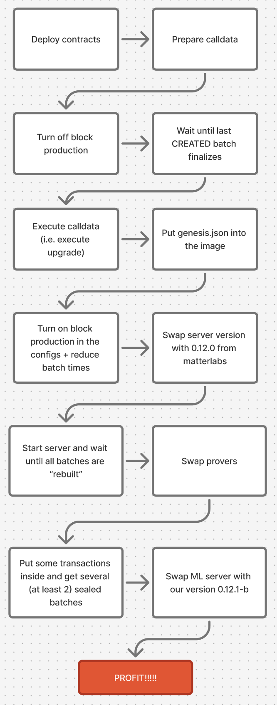

# v29→v30 Rollup Upgrade (Ecosystem & Chain)

Area: Upgrade
Created by: Mykhailo Slyvka
Edited at: January 21, 2026 10:28 AM
Type: Tutorial
Status: Done
zkOS Execution Version: 4

This is an example and guide how to do an upgrade. The flow shows how upgrade from v0.29.11 to v.0.30.0 is done and what steps are required.



# Step 0. Stop server with version v0.10.1, contracts version v0.29.11 and execution version 4

At the very beginning you need to stop sequencer **AFTER it processed all existing batches**. So there are no pending blocks, transactions or batches. You can set `sequencer_max_blocks_to_produce=0` so no new blocks will be created, restart server and wait some time so we are sure that state is finalized.

# Step 1. Prepare upgrade config

1. Clone era-contracts repo and switch to branch with upgrade script. e.g. `v30-zksync-os-upgrade` for v30 upgrade.

    ```bash
    git clone https://github.com/matter-labs/era-contracts.git
    cd era-contracts
    git checkout v30-zksync-os-upgrade
    git submodule update --init --recursive
    ```

2. Fix the `remappings.txt`

    ```bash

    # from the root of cloned era-contracts
    cd l1-contracts
    # Remove any existing erc4626-tests remapping (correct or incorrect)
    sed -i '/^erc4626-tests=/d' remappings.txt
    # Add the correct remapping at the end
    echo >> remappings.txt
    echo "erc4626-tests/=lib/openzeppelin-contracts-upgradeable-v4/lib/erc4626-tests/" >> remappings.txt
    cd ..
    ```

3. Build smart contracts:

    ```bash
    # from the root of cloned era-contracts
    cd l1-contracts && yarn install && yarn build:foundry && cd ..
    cd system-contracts && yarn install && yarn build && cd ..
    cd da-contracts && forge build && cd ..
    cd l1-contracts
    ```

4. Prepare **Upgrade Input TOML**. Some useful commands to verify or get some data will be below the example. Change needed fields

    Save the file with path `era-contracts/l1-contracts/upgrade-envs/v0.30.0-zksync-os-blobs/chain.toml`.

    ```bash
    # in the l1-contracts dir
    vi upgrade-envs/v0.30.0-zksync-os-blobs/chain.toml
    ```

    REQUIRED to change fields:

    - era_chain_id - you chain id
    - testnet_verifier  - set true, if you use fake proofs, e.g. do not use real provers instead of fake
    - owner_address  - set your ecosystem governance smart contract (`configs/contracts.yaml:19:  governance_addr: 0x123…..`)
    - create2_factory_salt/create2_factory_addr - get them from the top of `configs/contract.yaml`
    - bridgehub_proxy_address - set your brdigehub address
    - [gateway].chain_id  - you chain id
    - [zksync_os].chain_id  - you chain id
    - token_weth_address - change to `0xC02aaA39b223FE8D0A0e5C4F27eAD9083C756Cc2` **only for Mainnet**

```bash
era_chain_id = 444 # CHANGE THIS
testnet_verifier = false # CHANGE THIS
governance_upgrade_timer_initial_delay = 0
# Note, that this is NOT the owner of the bridgehub, but the owner of the zksync os CTM - usually ecosystem governance smart contract "governance_addr"
owner_address = "0xF6A96e4e5b602DDbf34E166729da97dbb2A3bEE2" # CHANGE THIS

# This should always be false for non-loadtest environments.
support_l2_legacy_shared_bridge_test = false

old_protocol_version = "0x1d00000000" # v0.29.0 version

priority_txs_l2_gas_limit = 2000000
max_expected_l1_gas_price = 50000000000
is_zk_sync_os = true
redeploy_da_manager = true

[contracts]
governance_min_delay = 0

max_number_of_chains = 100
create2_factory_salt = "0x85de5677ffea74c9815331db7f5c737a33c161db4cae7d47504a336c4c5bcfdc" # CHANGE THIS
create2_factory_addr = "0x4e59b44847b379578588920cA78FbF26c0B4956C" # CHANGE THIS
validator_timelock_execution_delay = 0
genesis_root = "0xc346a158cce093e99ab65a95c884a26629d0e4f8d00ae20bbca4bfc4b204eec2" # CHANGE THIS  if not v0.29.* version (you have another genesis_root in genesis.json)
genesis_rollup_leaf_index = 0
genesis_batch_commitment = "0000000000000000000000000000000000000000000000000000000000000001"
recursion_node_level_vk_hash = "0x0000000000000000000000000000000000000000000000000000000000000000"
recursion_leaf_level_vk_hash = "0x0000000000000000000000000000000000000000000000000000000000000000"
recursion_circuits_set_vks_hash = "0x0000000000000000000000000000000000000000000000000000000000000000"
priority_tx_max_gas_limit = 72000000
diamond_init_pubdata_pricing_mode = 0
diamond_init_batch_overhead_l1_gas = 1000000
diamond_init_max_pubdata_per_batch = 120000
diamond_init_max_l2_gas_per_batch = 80000000
diamond_init_priority_tx_max_pubdata = 99000
diamond_init_minimal_l2_gas_price = 250000000
bootloader_hash = "0x0000000000000000000000000000000000000000000000000000000000000001"
default_aa_hash = "0x0000000000000000000000000000000000000000000000000000000000000001"
evm_emulator_hash = "0x0000000000000000000000000000000000000000000000000000000000000001"
bridgehub_proxy_address = "0xb339725f29090657f39df0c8c0c573f0856a45fe" # CHANGE THIS
# Does not matter, a new one should be deployed
rollup_da_manager = "0x072b8a4614f803d6b306f49c47928fb8d9d098c3"

# Does not matter
governance_security_council_address = "0xbD19b7cB59085cF723738c3ECaD61dA8e62C04A8"

latest_protocol_version = 0x1e00000000 # v0.30.0 version
# Unused as bytecode supplier is not supported in this upgrade.
l1_bytecodes_supplier_addr = "0x960ca48fcb67853bbacfa9e7b25ce66dfca9e851"

[tokens]
token_weth_address = "0x7b79995e5f793a07bc00c21412e50ecae098e7f9" # This is Sepolia, 0xC02aaA39b223FE8D0A0e5C4F27eAD9083C756Cc2 - for Mainnet, zeros for dev chains

# We do not use Gateway so just set our chain ID
[gateway]
chain_id = 444 # CHANGE THIS

[zksync_os]
sample_chain_id = 444 # CHANGE THIS

# NOTE: These addresses are NOT read by the v30 upgrade script.
# The script deploys fresh versions of all these contracts.
[state_transition]
admin_facet_addr = "0x493EE7a0AbB24C0550BB57243ff3Fe93D169842B"
default_upgrade_addr = "0xDA65afc634528bC2ef5149d811Acda864dD78Ab6"
diamond_init_addr = "0x84B53B9F74921112681461275ac26363bF396D77"
executor_facet_addr = "0x130a4150562aA510b79292100A9Af0C90244e085"
genesis_upgrade_addr = "0x7Dde6ce8Ee4865f4BBD134d3BE827DBE5282100E"
getters_facet_addr = "0xae5cbB5f70e134668a13d7C8EcEF5e9E6FffCF22"
verifier_addr = "0x953d58723b3D643880d4951Ec540fc011d4D459b"

# zeros, we do not have gateway
[gateway.gateway_state_transition]
chain_type_manager_proxy_addr = "0x0000000000000000000000000000000000000000"
rollup_da_manager = "0x0000000000000000000000000000000000000000"
chain_type_manager_proxy_admin = "0x0000000000000000000000000000000000000000"
rollup_sl_da_validator = "0x0000000000000000000000000000000000000000"
admin_facet_addr = "0x0000000000000000000000000000000000000000"
default_upgrade_addr = "0x0000000000000000000000000000000000000000"
diamond_init_addr = "0x0000000000000000000000000000000000000000"
executor_facet_addr = "0x0000000000000000000000000000000000000000"
genesis_upgrade_addr = "0x0000000000000000000000000000000000000000"
getters_facet_addr = "0x0000000000000000000000000000000000000000"
verifier_addr = "0x0000000000000000000000000000000000000000"

```

Useful commands:

1. Get CTM address of chain

```bash
# CHANGE values to yours
RPC=http://127.0.0.1:8545
BRIDGEHUB=0x0d09cfd4845fee189d9d15f4960fd8d202ea6ecc
CHAIN_ID=555

CTM=$(cast call $BRIDGEHUB "chainTypeManager(uint256)(address)" $CHAIN_ID --rpc-url $RPC)

echo $CTM
```

1. Get owner of contract (e.g get Governance smart contract address)

```bash
cast call $CTM "owner()(address)" --rpc-url $RPC
```

1. Get current protocol version. This will return decimal number like `124554051584`, which you need to convert to hex like `1D00000000` -> “29”

```bash
cast call $CTM "protocolVersion()(uint256)" --rpc-url $RPC
# 124554051584
```

1. How to create a hex value of protocol version from semver:

```bash
MAJOR=30
MINOR=0
PATCH=0

VERSION=$(( (MAJOR << 32) | (MINOR << 24) | PATCH ))
printf "0x%x\n" $VERSION
# Output: 0x1e00000000
```

1. How to get governance_security_council_address :

```bash
cast call {Ecosystem Governance smart contract} "securityCouncil()(address)" --rpc-url $RPC
```

# Step 2. L1 Ecosystem Upgrade → `v30-ecosystem.yaml`

1. You may need to fix the `l1-contracts/foundry.toml` first:

    ```bash
    sed -i.bak 's/{ access = "read", path = "\.\.\/l1-contracts\/script-out\/" }/{ access = "read-write", path = "..\/l1-contracts\/script-out\/" }/' foundry.toml
    ```

    *It resolves an error “Error: script failed: vm.writeToml: the path script-out/v30-ecosystem.toml is not allowed to be accessed for write operations”*

2. Simulate the deployment (simulates transactions, outputs the upgrade data, i.e. required addresses, config addresses, protocol version and the Diamond Cuts). Note: some file names are different for other upgrades. You can use any private key as deployer, because ownership will be transfered during the upgrade.

    ```bash
    # SET THE GAS PRICE (!!!!!!!)
    DEPLOYER_PK={Deployer Private Key}

    UPGRADE_ECOSYSTEM_INPUT=/upgrade-envs/v0.30.0-zksync-os-blobs/chain.toml UPGRADE_ECOSYSTEM_OUTPUT=/script-out/v30-ecosystem.toml forge script deploy-scripts/upgrade/EcosystemUpgrade_v30_zksync_os_blobs.s.sol:EcosystemUpgrade_v30_zksync_os_blobs --ffi --rpc-url $RPC --with-gas-price 1000000000  --private-key $DEPLOYER_PK
    ```

    This will create a file `./script-out/v30-ecosystem.toml` that will include new addresses of contracts that will be deployed for chain.

    <aside>
    ⚠️

    If you didn’t change `create2_factory_salt` (or do use the same {Deployer PK}) for the second ecosystem upgrade, you’ll get *errors* because the upgrade process creates smart contracts using `create2` which derives addresses deterministically from the deployer PK.

    </aside>

    <aside>
    ℹ️

    Use  `--fork-block-number 10034460` to test pre-update state of some unsuccessful update.

    </aside>

3. Verify contracts
    1. Download [https://github.com/matter-labs/zksync-os-server/blob/c8698a683546e29a6e9e2fc58cac4371bbb4c80c/lib/l1_watcher/src/factory_deps/contracts.json#L39](https://github.com/matter-labs/zksync-os-server/blob/c8698a683546e29a6e9e2fc58cac4371bbb4c80c/lib/l1_watcher/src/factory_deps/contracts.json#L39) to `contracts.json`.
    2. Download this script:

    ```python
    import json
    import sys
    import argparse
    import re

    def main():
        parser = argparse.ArgumentParser(description='Find bytecode_hash values from contracts.json in YAML file')
        parser.add_argument('yaml_file', help='Path to YAML file (e.g., script-out/v30-test.yaml)')
        parser.add_argument('contracts_json', help='Path to contracts.json file')

        args = parser.parse_args()

        # Read contracts.json
        with open(args.contracts_json, 'r') as f:
            contracts = json.load(f)

        # Read YAML file
        with open(args.yaml_file, 'r') as f:
            yaml_content = f.read()

        # Find all bytecode_hash values (without 0x prefix)
        missing = []
        found = []
        known_hashes = set()

        yaml_lower = yaml_content.lower()

        for contract_name, contract_data in contracts.items():
            if 'bytecode_hash' not in contract_data:
                continue

            hash_value = contract_data['bytecode_hash']
            # Remove 0x prefix if present
            if hash_value.startswith('0x'):
                hash_value = hash_value[2:]

            hv = hash_value.lower()
            known_hashes.add(hv)

            # Search for hash in YAML content (case-insensitive)
            if hv in yaml_lower:
                found.append(contract_name)
            else:
                missing.append((contract_name, hash_value))

        # Independently find 00000060<hash> occurrences in the first file and report hashes not in contracts.json
        extracted = {m.group(1).lower() for m in re.finditer(r'00000060([0-9a-fA-F]{64})', yaml_content)}
        extra = sorted(extracted - known_hashes)

        # Skip noise:
        # - hashes starting with c37bb1bc
        # - hashes with many leading zeros (>= 24)
        extra = [
            h for h in extra
            if not h.startswith("c37bb1bc") and not re.match(r"^0{24,}", h)
        ]

        # Print results
        print(f"Found {len(found)}/{len(contracts)} hashes:")
        for name in found:
            print(f"  ✓ {name}")

        if missing:
            print(f"\nMissing {len(missing)} hashes (3 missing is expected for v30.1):")
            for contract_name, hash_value in missing:
                print(f"  ✗ {contract_name}")
                print(f"    Hash: {hash_value}")
                # Show first 20 chars of hash for debugging
                hv = hash_value.lower()
                if f"0x{hv}" in yaml_lower:
                    print(f"    Note: Found with 0x prefix")
                print()
        else:
            print("\nAll hashes found!")

        if extra:
            print(f"\n[INFO] Found {len(extra)} extra 00000060<hash> entries not in contracts.json:")
            for h in extra:
                print(f"  + {h}")

    if __name__ == '__main__':
        main()
    ```

    - Run

        ```python
        python3 ./validate-bytecode.py script-out/v30-ecosystem.toml contracts.json
        ```

4. 🚀 Run (`—broadcast`) the deployment/calldata preparation script. Note: you can use any private key, all ownership will be transfered to proper owners.

    ```bash
    # SET GAS PRICE (!!!!!!)
    UPGRADE_ECOSYSTEM_INPUT=/upgrade-envs/v0.30.0-zksync-os-blobs/chain.toml UPGRADE_ECOSYSTEM_OUTPUT=/script-out/v30-ecosystem.toml forge script deploy-scripts/upgrade/EcosystemUpgrade_v30_zksync_os_blobs.s.sol:EcosystemUpgrade_v30_zksync_os_blobs --ffi --rpc-url $RPC --with-gas-price 1000000000 --private-key $DEPLOYER_PK --broadcast
    ```


1. 🚀 Generate the YAML file for the upgrade (generating calldata). IMPORTANT: change file/dir autogenerated names.  like `31337/run-latest.json` (it’s ***<chain ID>**/run-latest.json*)

```bash
UPGRADE_ECOSYSTEM_OUTPUT=script-out/v30-ecosystem.toml UPGRADE_ECOSYSTEM_OUTPUT_TRANSACTIONS=./broadcast/EcosystemUpgrade_v30_zksync_os_blobs.s.sol/31337/run-latest.json YAML_OUTPUT_FILE=script-out/v30-ecosystem.yaml yarn upgrade-yaml-output-generator
```

# Step 3. L1 Upgrade: calldata → Governor

1. Save logs (MUST HAVE for testnet/mainnet, optional for devnet)
    1. move `script-out/v30-ecosystem.yaml` to `upgrade-envs/v0.30.0-zksync-os-blobs/output/{your_network}/v30-ecosystem.yaml`
    2. move `broadcast/EcosystemUpgrade_v30_zksync_os_blobs.s.sol/{l1_chain_id}/run-latest.json` to `upgrade-envs/v0.30.0-zksync-os-blobs/output/{your_network}/run-latest.json`

    ```bash
    # SET CHAIN ID (!!!!!!!)
    mkdir -p upgrade-envs/v0.30.0-zksync-os-blobs/output/adi
    cp script-out/v30-ecosystem.yaml upgrade-envs/v0.30.0-zksync-os-blobs/output/adi/v30.0-ecosystem.yaml
    cp script-out/v30-ecosystem.toml upgrade-envs/v0.30.0-zksync-os-blobs/output/adi/v30.0-ecosystem.toml
    cp broadcast/EcosystemUpgrade_v30_zksync_os_blobs.s.sol/31337/run-latest.json upgrade-envs/v0.30.0-zksync-os-blobs/output/adi/run-latest.json
    ```

2. Transform calls to calldata
    - From all the generated data, we are only interested in the `stage1_calls` field from `v30-ecosystem.yaml` or `v30-ecosystem.toml`.

        

        `stage1_calls` is not a final calldata but rather a list of calls that can be transformed into calldata.

        Extract them:

        ```bash
        export STAGE1_CALLS="$(sed -nE 's/.*stage1_calls = "(0x[0-9a-fA-F]+)".*/\1/p' script-out/v30-ecosystem.toml)"
        ```

    - Copy the file below and create a file from it.
    - script:

        [encode_calls.py](artifacts/encode_calls.py)

    - Example Usage

    ```bash
    sudo apt install python3-pip
    pip3 install eth-abi "eth-hash[pycryptodome]" # --break-system-packages

    nano encode_calls.py # insert file data
    python3 encode_calls.py --calls-encoded $STAGE1_CALLS > calls_encoded.txt
    ```

    - Output Example

        ```jsx
        scheduleTransparent signature: scheduleTransparent(((address,uint256,bytes)[],bytes32,bytes32),uint256)
        scheduleTransparent selector:  0x2c431917
        scheduleTransparent calldata:  0x2c43191700000000000000000000000000000000000000000000000000000000000000400000000000000000000000000000000000000000000000000000000000000000000000000000000000000000000000000000000000000000000000000000006000000000000000000000000000000000000000000000000000000000000000000000000000000000000000000000000000000000000000000000000000000000000000000000000000000000000000000000000000000000000000000000000300000000000000000000000000000000000000000000000000000000000000600000000000000000000000000000000000000000000000000000000000001cc000000000000000000000000000000000000000000000000000000000000023a00000000000000000000000001adf137f59949c9081157d5de1e002d1c992071f000000000000000000000000000000000000000000000000000000000000000000000000000000000000000000000000000000000000000000000000000000600000000000000000000000000000000000000000000000000000000000001bc49b016b8b00000000000000000000000000000000000000000000000000000000000000200000000000000000000000002bf9b0b72573af5471c4f035271616139392acd8423c107626aff95d3d086eabd92132dc9485e021ae3cb4c7735d5e963578e3d00000000000000000000000000000000000000000000000000000000000000000000000000000000000000000000000000000000000000000000000000000000100000000000000000000000000000000000000000000000000000000000000c00000000000000000000000000000000000000000000000000000000000001140000000000000000000000000000000000000000000000000000000000000006000000000000000000000000077e0eaf7220783b372eb694cecd68d2663797a440000000000000000000000000000000000000000000000000000000000000ea00000000000000000000000000000000000000000000000000000000000000004000000000000000000000000000000000000000000000000000000000000008000000000000000000000000000000000000000000000000000000000000003e00000000000000000000000000000000000000000000000000000000000000a800000000000000000000000000000000000000000000000000000000000000ce0000000000000000000000000a8af3cff5c286f07f148b9c5d4a7b3fc358b1a5e00000000000000000000000000000000000000000000000000000000000000000000000000000000000000000000000000000000000000000000000000000000000000000000000000000000000000000000000000000000000000000000008000000000000000000000000000000000000000000000000000000000000000160e18b681000000000000000000000000000000000000000000000000000000001733894500000000000000000000000000000000000000000000000000000000fc57565f000000000000000000000000000000000000000000000000000000001cc5d1030000000000000000000000000000000000000000000000000000000021f603d700000000000000000000000000000000000000000000000000000000235d9eb5000000000000000000000000000000000000000000000000000000002765d0790000000000000000000000000000000000000000000000000000000027ae4c16000000000000000000000000000000000000000000000000000000002878fe74000000000000000000000000000000000000000000000000000000003f42d5dd0000000000000000000000000000000000000000000000000000000041cf49bb000000000000000000000000000000000000000000000000000000004623c91d000000000000000000000000000000000000000000000000000000004dd18bf5000000000000000000000000000000000000000000000000000000005b8987480000000000000000000000000000000000000000000000000000000064b554ad0000000000000000000000000000000000000000000000000000000064bf8d66000000000000000000000000000000000000000000000000000000006e762e9800000000000000000000000000000000000000000000000000000000a9f6d94100000000000000000000000000000000000000000000000000000000b4fcb57700000000000000000000000000000000000000000000000000000000b784610700000000000000000000000000000000000000000000000000000000be6f11cf00000000000000000000000000000000000000000000000000000000e76db86500000000000000000000000000000000000000000000000000000000000000000000000000000000a433fcf5b1d6e9a74633fcd2391d71b49b20f4f3000000000000000000000000000000000000000000000000000000000000000000000000000000000000000000000000000000000000000000000000000000000000000000000000000000000000000000000000000000000000000000000080000000000000000000000000000000000000000000000000000000000000003006d49e5b000000000000000000000000000000000000000000000000000000000ec6b0b700000000000000000000000000000000000000000000000000000000fe26699e0000000000000000000000000000000000000000000000000000000018e3a941000000000000000000000000000000000000000000000000000000001de72e340000000000000000000000000000000000000000000000000000000022c5cf230000000000000000000000000000000000000000000000000000000029b98c670000000000000000000000000000000000000000000000000000000033ce93fe000000000000000000000000000000000000000000000000000000003408e470000000000000000000000000000000000000000000000000000000003591c1a000000000000000000000000000000000000000000000000000000000396073820000000000000000000000000000000000000000000000000000000039d7d4aa0000000000000000000000000000000000000000000000000000000046657fe90000000000000000000000000000000000000000000000000000000052ef6b2c000000000000000000000000000000000000000000000000000000005a59033500000000000000000000000000000000000000000000000000000000631f4bac000000000000000000000000000000000000000000000000000000006a27e8b5000000000000000000000000000000000000000000000000000000006e9960c30000000000000000000000000000000000000000000000000000000074f4d30d0000000000000000000000000000000000000000000000000000000079823c9a000000000000000000000000000000000000000000000000000000007a0ed627000000000000000000000000000000000000000000000000000000007b30c8da000000000000000000000000000000000000000000000000000000008708474e00000000000000000000000000000000000000000000000000000000946ebad100000000000000000000000000000000000000000000000000000000960dcf240000000000000000000000000000000000000000000000000000000098acd7a6000000000000000000000000000000000000000000000000000000009cd939e4000000000000000000000000000000000000000000000000000000009d1b5a8100000000000000000000000000000000000000000000000000000000a1954fc500000000000000000000000000000000000000000000000000000000adfca15e00000000000000000000000000000000000000000000000000000000af6a2dcd00000000000000000000000000000000000000000000000000000000b22dd78e00000000000000000000000000000000000000000000000000000000b8c2f66f00000000000000000000000000000000000000000000000000000000bd7c541200000000000000000000000000000000000000000000000000000000c3bbd2d700000000000000000000000000000000000000000000000000000000cdffacc600000000000000000000000000000000000000000000000000000000d046815600000000000000000000000000000000000000000000000000000000d86970d800000000000000000000000000000000000000000000000000000000db1f0bf900000000000000000000000000000000000000000000000000000000dd655bb000000000000000000000000000000000000000000000000000000000e5355c7500000000000000000000000000000000000000000000000000000000e81e0ba100000000000000000000000000000000000000000000000000000000ea6c029c00000000000000000000000000000000000000000000000000000000ef3f0bae00000000000000000000000000000000000000000000000000000000f4ff5e2e00000000000000000000000000000000000000000000000000000000f5c1182c00000000000000000000000000000000000000000000000000000000facd743b00000000000000000000000000000000000000000000000000000000fd791f3c00000000000000000000000000000000000000000000000000000000000000000000000000000000883e3226558c7e0a1a6586003975dbcc226e7274000000000000000000000000000000000000000000000000000000000000000000000000000000000000000000000000000000000000000000000000000000010000000000000000000000000000000000000000000000000000000000000080000000000000000000000000000000000000000000000000000000000000000e042901c70000000000000000000000000000000000000000000000000000000012f43dab00000000000000000000000000000000000000000000000000000000eb6724190000000000000000000000000000000000000000000000000000000018b7fc2200000000000000000000000000000000000000000000000000000000263b7f8e000000000000000000000000000000000000000000000000000000006c0960f90000000000000000000000000000000000000000000000000000000079cf6165000000000000000000000000000000000000000000000000000000007efda2ae00000000000000000000000000000000000000000000000000000000b473318e00000000000000000000000000000000000000000000000000000000d077255100000000000000000000000000000000000000000000000000000000d07b90d100000000000000000000000000000000000000000000000000000000ddcc9eec00000000000000000000000000000000000000000000000000000000e4948f4300000000000000000000000000000000000000000000000000000000e896760d00000000000000000000000000000000000000000000000000000000000000000000000000000000d9232796ee7ad3d8eb38bef3a0c1eaf30de9d29200000000000000000000000000000000000000000000000000000000000000000000000000000000000000000000000000000000000000000000000000000001000000000000000000000000000000000000000000000000000000000000008000000000000000000000000000000000000000000000000000000000000000050b6db820000000000000000000000000000000000000000000000000000000000db9eb8700000000000000000000000000000000000000000000000000000000a085344d000000000000000000000000000000000000000000000000000000007ca4eff7000000000000000000000000000000000000000000000000000000009271e4500000000000000000000000000000000000000000000000000000000000000000000000000000000000000000000000000000000000000000000001c0000000000000000000000000da5e793b8ae713241d5cb681fd987704e59f745900000000000000000000000000000000000000000000000000000000000000000000000000000000000000000000000000000000000000000000000000000000000000000000000000000000000000000000000000000000000000000000000000000000000000000000000000000000000000000000000000000000000000010000000000000000000000000000000000000000000000000000000000000001000000000000000000000000000000000000000000000000000000000000000100000000000000000000000000000000000000000000000000000000044aa200000000000000000000000000000000000000000000000000000000000000000000000000000000000000000000000000000000000000000000000000000f4240000000000000000000000000000000000000000000000000000000000001d4c00000000000000000000000000000000000000000000000000000000004c4b40000000000000000000000000000000000000000000000000000000000000182b8000000000000000000000000000000000000000000000000000000000ee6b2800000000000000000000000000000000000000000000000000000000000000a400000000000000000000000000000000000000000000000000000000000000020000000000000000000000000000000000000000000000000000000000000000100000000000000000000000000000000000000000000000000000000000001440000000000000000000000008829ad80e425c646dab305381ff105169feece56010000f1477ebc7355591c664c501757b31e9cd0025d565546fc0054f28a6411000000000000000000000000d7800b45c05cf654eec093650fd67865e85e9677000000000000000000000000000000000000000000000000000000000000006400000000000000000000000000000000000000000000000000000000000001e0000000000000000000000000000000000000000000000000000000000000034000000000000000000000000000000000000000000000000000000000000004a00000000000000000000000000000000000000000000000000000000000000600000000000000000000000000000000000000000000000000000000000000076000000000000000000000000000000000000000000000000000000000000008c00000000000000000000000000000000000000000000000000000000000000000000000000000000000000000000000000000000000000000000000000000000000000000000000000000000000000000000000000000000000000000000000000000000000000000000000000000000000000000000000000000000000000140000000000000000000000000000000000000000000000000000000000000004000000000000000000000000000000000000000000000000000000000000000c000000000000000000000000000000000000000000000000000000000000000604cdf52a9a78024a7b5b1d31faa6de33eb6159ee71f02733c27de62106cb3d9ee00000000000000000000000000000000000000000000000000000000000030831dc8d8d6c1eb16ade1b790365a9007a3ca7247ee7de00b576b43e21d28918f9d0000000000000000000000000000000000000000000000000000000000000060b09a95cb43a3f5d388e945b68f8b8a814681d60e8252ed08cba7a3d591a152df0000000000000000000000000000000000000000000000000000000000000e0b09301da5bbb08e078e7a51cdb957dd25945efd0ec3b056137d344c929ecdc9c30000000000000000000000000000000000000000000000000000000000000140000000000000000000000000000000000000000000000000000000000000004000000000000000000000000000000000000000000000000000000000000000c000000000000000000000000000000000000000000000000000000000000000601c085665f2a51715c66b88f52f86f081e01bb941faf55d5fa9dbd6fe97cd683a0000000000000000000000000000000000000000000000000000000000002c5b5ad3d9403af0d911ee4aeadbbde9c353814fdbc7679c20c99f5f944c43f1dee00000000000000000000000000000000000000000000000000000000000000060b09a95cb43a3f5d388e945b68f8b8a814681d60e8252ed08cba7a3d591a152df0000000000000000000000000000000000000000000000000000000000000e0b09301da5bbb08e078e7a51cdb957dd25945efd0ec3b056137d344c929ecdc9c30000000000000000000000000000000000000000000000000000000000000140000000000000000000000000000000000000000000000000000000000000004000000000000000000000000000000000000000000000000000000000000000c000000000000000000000000000000000000000000000000000000000000000606dac35ffb85d51f76e2de0febb2b0f92ee424e38d51f8401773c17687a595d1c0000000000000000000000000000000000000000000000000000000000004580346683d96f68106a10b9f36edea22e1189e45255e05dd465c6d101ea2a360ab90000000000000000000000000000000000000000000000000000000000000060b09a95cb43a3f5d388e945b68f8b8a814681d60e8252ed08cba7a3d591a152df0000000000000000000000000000000000000000000000000000000000000e0b09301da5bbb08e078e7a51cdb957dd25945efd0ec3b056137d344c929ecdc9c30000000000000000000000000000000000000000000000000000000000000140000000000000000000000000000000000000000000000000000000000000004000000000000000000000000000000000000000000000000000000000000000c000000000000000000000000000000000000000000000000000000000000000609df14aba83ab80ad0df8cd4146b743788f4fcf00d4c8e636040081d44497e639000000000000000000000000000000000000000000000000000000000000183d5865ccbc7d551fc1802e091886ffa94586436778d22ce646d4bcb392360df5c00000000000000000000000000000000000000000000000000000000000000060b09a95cb43a3f5d388e945b68f8b8a814681d60e8252ed08cba7a3d591a152df0000000000000000000000000000000000000000000000000000000000000e0b09301da5bbb08e078e7a51cdb957dd25945efd0ec3b056137d344c929ecdc9c30000000000000000000000000000000000000000000000000000000000000140000000000000000000000000000000000000000000000000000000000000004000000000000000000000000000000000000000000000000000000000000000c000000000000000000000000000000000000000000000000000000000000000601a36318670b6ab973e68178a10d6107227fde6d027573d7668e61760d22a867a00000000000000000000000000000000000000000000000000000000000020064d5c32f28646ef26d746e078bd9d9c5797178e9959013bc13ec4ed42122d60220000000000000000000000000000000000000000000000000000000000000060b09a95cb43a3f5d388e945b68f8b8a814681d60e8252ed08cba7a3d591a152df0000000000000000000000000000000000000000000000000000000000000e0b09301da5bbb08e078e7a51cdb957dd25945efd0ec3b056137d344c929ecdc9c30000000000000000000000000000000000000000000000000000000000000140000000000000000000000000000000000000000000000000000000000000004000000000000000000000000000000000000000000000000000000000000000c00000000000000000000000000000000000000000000000000000000000000060c49018245ed5bebb0e9124546c1716a564864c451ec6e65931cc80bbe5400cc60000000000000000000000000000000000000000000000000000000000003a13db0d981bf1867108c27f2c52334c4f31d8bb88e17f6955ce85930568086974600000000000000000000000000000000000000000000000000000000000000060b09a95cb43a3f5d388e945b68f8b8a814681d60e8252ed08cba7a3d591a152df0000000000000000000000000000000000000000000000000000000000000e0b09301da5bbb08e078e7a51cdb957dd25945efd0ec3b056137d344c929ecdc9c3000000000000000000000000000000000000000000000000000000000000000000000000000000001adf137f59949c9081157d5de1e002d1c992071f0000000000000000000000000000000000000000000000000000000000000000000000000000000000000000000000000000000000000000000000000000006000000000000000000000000000000000000000000000000000000000000006442e52285100000000000000000000000000000000000000000000000000000000000000800000000000000000000000000000000000000000000000000000001e00000000ffffffffffffffffffffffffffffffffffffffffffffffffffffffffffffffff0000000000000000000000000000000000000000000000000000001e000000010000000000000000000000000000000000000000000000000000000000000060000000000000000000000000175a48b7d2d596d66d7b0dada23cf8909d8cfa2300000000000000000000000000000000000000000000000000000000000000800000000000000000000000000000000000000000000000000000000000000000000000000000000000000000000000000000000000000000000000000000050416ef130300000000000000000000000000000000000000000000000000000000000000200000000000000000000000000000000000000000000000000000000000000180000000000000000000000000000000000000000000000000000000000000000000000000000000000000000000000000000000000000000000000000000000000000000000000000000000000000000000000000000000000000000000000000000000000000000000000000da5e793b8ae713241d5cb681fd987704e59f745900000000000000000000000000000000000000000000000000000000000000000000000000000000000000000000000000000000000000000000000000000000000000000000000000000000000000000000000000000000000000000000000000000000000000000000000000000000000000000000000000000000000004a000000000000000000000000000000000000000000000000000000000000004c000000000000000000000000000000000000000000000000000000000000000000000000000000000000000000000000000000000000000000000001e00000001000000000000000000000000000000000000000000000000000000000000000000000000000000000000000000000000000000000000000000000000000000000000000000000000000000000000000000000000000000000000000000000000000000000000000000000000000000000000000000000000000000000000000000000000000000000000000000000000000000000000000000000000000000000000000000000000000000000000000000000000000000000000000000000000000000000000000000000000000000000000000000000000000000000000000000000000000000000000000000000000000000000000000000000000000000000000000000000000000000000000000000000000000000000000000000000000000000000000000000000000000000000000000000000000000000000000000000000000000000000000000000000000000000000000000000000000000000000000000000000000000000000000000000000000000000000000000000000000000000000000000000000000000000000000000000000000000000000000000000000000000000000000000000000000000000000000000000000000000000000000000000000000000000000000000000000000000000000000000000000260000000000000000000000000000000000000000000000000000000000000028000000000000000000000000000000000000000000000000000000000000002a000000000000000000000000000000000000000000000000000000000000002e00000000000000000000000000000000000000000000000000000000000000300000000000000000000000000000000000000000000000000000000000000000000000000000000000000000000000000000000000000000000000000000000000000000000000000000000000000000000000000000000000000000000000001000000000000000000000000000000000000000000000000000000000000000000000000000000000000000000000000000000000000000000000000000000000000000000000000000000000000000000000000000000000000000000000000000000000000000000000000000000000000000000000000000000000000000000000000000000000000000000000000000000000000000000000000000000000000000000000000000000000000000000000000000000000000000000000000000000000000000000000000000000000000000000000000000000000000000000000000da5e793b8ae713241d5cb681fd987704e59f745900000000000000000000000000000000000000000000000000000000000000000000000000000000000000000000000000000000000000000000000000000060000000000000000000000000000000000000000000000000000000000000000479ba509700000000000000000000000000000000000000000000000000000000

        execute signature:             execute(((address,uint256,bytes)[],bytes32,bytes32))
        execute selector:              0x74da756b
        execute calldata:              0x74da756b0000000000000000000000000000000000000000000000000000000000000020000000000000000000000000000000000000000000000000000000000000006000000000000000000000000000000000000000000000000000000000000000000000000000000000000000000000000000000000000000000000000000000000000000000000000000000000000000000000000000000000000000000000000300000000000000000000000000000000000000000000000000000000000000600000000000000000000000000000000000000000000000000000000000001cc000000000000000000000000000000000000000000000000000000000000023a00000000000000000000000001adf137f59949c9081157d5de1e002d1c992071f000000000000000000000000000000000000000000000000000000000000000000000000000000000000000000000000000000000000000000000000000000600000000000000000000000000000000000000000000000000000000000001bc49b016b8b00000000000000000000000000000000000000000000000000000000000000200000000000000000000000002bf9b0b72573af5471c4f035271616139392acd8423c107626aff95d3d086eabd92132dc9485e021ae3cb4c7735d5e963578e3d00000000000000000000000000000000000000000000000000000000000000000000000000000000000000000000000000000000000000000000000000000000100000000000000000000000000000000000000000000000000000000000000c00000000000000000000000000000000000000000000000000000000000001140000000000000000000000000000000000000000000000000000000000000006000000000000000000000000077e0eaf7220783b372eb694cecd68d2663797a440000000000000000000000000000000000000000000000000000000000000ea00000000000000000000000000000000000000000000000000000000000000004000000000000000000000000000000000000000000000000000000000000008000000000000000000000000000000000000000000000000000000000000003e00000000000000000000000000000000000000000000000000000000000000a800000000000000000000000000000000000000000000000000000000000000ce0000000000000000000000000a8af3cff5c286f07f148b9c5d4a7b3fc358b1a5e00000000000000000000000000000000000000000000000000000000000000000000000000000000000000000000000000000000000000000000000000000000000000000000000000000000000000000000000000000000000000000000008000000000000000000000000000000000000000000000000000000000000000160e18b681000000000000000000000000000000000000000000000000000000001733894500000000000000000000000000000000000000000000000000000000fc57565f000000000000000000000000000000000000000000000000000000001cc5d1030000000000000000000000000000000000000000000000000000000021f603d700000000000000000000000000000000000000000000000000000000235d9eb5000000000000000000000000000000000000000000000000000000002765d0790000000000000000000000000000000000000000000000000000000027ae4c16000000000000000000000000000000000000000000000000000000002878fe74000000000000000000000000000000000000000000000000000000003f42d5dd0000000000000000000000000000000000000000000000000000000041cf49bb000000000000000000000000000000000000000000000000000000004623c91d000000000000000000000000000000000000000000000000000000004dd18bf5000000000000000000000000000000000000000000000000000000005b8987480000000000000000000000000000000000000000000000000000000064b554ad0000000000000000000000000000000000000000000000000000000064bf8d66000000000000000000000000000000000000000000000000000000006e762e9800000000000000000000000000000000000000000000000000000000a9f6d94100000000000000000000000000000000000000000000000000000000b4fcb57700000000000000000000000000000000000000000000000000000000b784610700000000000000000000000000000000000000000000000000000000be6f11cf00000000000000000000000000000000000000000000000000000000e76db86500000000000000000000000000000000000000000000000000000000000000000000000000000000a433fcf5b1d6e9a74633fcd2391d71b49b20f4f3000000000000000000000000000000000000000000000000000000000000000000000000000000000000000000000000000000000000000000000000000000000000000000000000000000000000000000000000000000000000000000000080000000000000000000000000000000000000000000000000000000000000003006d49e5b000000000000000000000000000000000000000000000000000000000ec6b0b700000000000000000000000000000000000000000000000000000000fe26699e0000000000000000000000000000000000000000000000000000000018e3a941000000000000000000000000000000000000000000000000000000001de72e340000000000000000000000000000000000000000000000000000000022c5cf230000000000000000000000000000000000000000000000000000000029b98c670000000000000000000000000000000000000000000000000000000033ce93fe000000000000000000000000000000000000000000000000000000003408e470000000000000000000000000000000000000000000000000000000003591c1a000000000000000000000000000000000000000000000000000000000396073820000000000000000000000000000000000000000000000000000000039d7d4aa0000000000000000000000000000000000000000000000000000000046657fe90000000000000000000000000000000000000000000000000000000052ef6b2c000000000000000000000000000000000000000000000000000000005a59033500000000000000000000000000000000000000000000000000000000631f4bac000000000000000000000000000000000000000000000000000000006a27e8b5000000000000000000000000000000000000000000000000000000006e9960c30000000000000000000000000000000000000000000000000000000074f4d30d0000000000000000000000000000000000000000000000000000000079823c9a000000000000000000000000000000000000000000000000000000007a0ed627000000000000000000000000000000000000000000000000000000007b30c8da000000000000000000000000000000000000000000000000000000008708474e00000000000000000000000000000000000000000000000000000000946ebad100000000000000000000000000000000000000000000000000000000960dcf240000000000000000000000000000000000000000000000000000000098acd7a6000000000000000000000000000000000000000000000000000000009cd939e4000000000000000000000000000000000000000000000000000000009d1b5a8100000000000000000000000000000000000000000000000000000000a1954fc500000000000000000000000000000000000000000000000000000000adfca15e00000000000000000000000000000000000000000000000000000000af6a2dcd00000000000000000000000000000000000000000000000000000000b22dd78e00000000000000000000000000000000000000000000000000000000b8c2f66f00000000000000000000000000000000000000000000000000000000bd7c541200000000000000000000000000000000000000000000000000000000c3bbd2d700000000000000000000000000000000000000000000000000000000cdffacc600000000000000000000000000000000000000000000000000000000d046815600000000000000000000000000000000000000000000000000000000d86970d800000000000000000000000000000000000000000000000000000000db1f0bf900000000000000000000000000000000000000000000000000000000dd655bb000000000000000000000000000000000000000000000000000000000e5355c7500000000000000000000000000000000000000000000000000000000e81e0ba100000000000000000000000000000000000000000000000000000000ea6c029c00000000000000000000000000000000000000000000000000000000ef3f0bae00000000000000000000000000000000000000000000000000000000f4ff5e2e00000000000000000000000000000000000000000000000000000000f5c1182c00000000000000000000000000000000000000000000000000000000facd743b00000000000000000000000000000000000000000000000000000000fd791f3c00000000000000000000000000000000000000000000000000000000000000000000000000000000883e3226558c7e0a1a6586003975dbcc226e7274000000000000000000000000000000000000000000000000000000000000000000000000000000000000000000000000000000000000000000000000000000010000000000000000000000000000000000000000000000000000000000000080000000000000000000000000000000000000000000000000000000000000000e042901c70000000000000000000000000000000000000000000000000000000012f43dab00000000000000000000000000000000000000000000000000000000eb6724190000000000000000000000000000000000000000000000000000000018b7fc2200000000000000000000000000000000000000000000000000000000263b7f8e000000000000000000000000000000000000000000000000000000006c0960f90000000000000000000000000000000000000000000000000000000079cf6165000000000000000000000000000000000000000000000000000000007efda2ae00000000000000000000000000000000000000000000000000000000b473318e00000000000000000000000000000000000000000000000000000000d077255100000000000000000000000000000000000000000000000000000000d07b90d100000000000000000000000000000000000000000000000000000000ddcc9eec00000000000000000000000000000000000000000000000000000000e4948f4300000000000000000000000000000000000000000000000000000000e896760d00000000000000000000000000000000000000000000000000000000000000000000000000000000d9232796ee7ad3d8eb38bef3a0c1eaf30de9d29200000000000000000000000000000000000000000000000000000000000000000000000000000000000000000000000000000000000000000000000000000001000000000000000000000000000000000000000000000000000000000000008000000000000000000000000000000000000000000000000000000000000000050b6db820000000000000000000000000000000000000000000000000000000000db9eb8700000000000000000000000000000000000000000000000000000000a085344d000000000000000000000000000000000000000000000000000000007ca4eff7000000000000000000000000000000000000000000000000000000009271e4500000000000000000000000000000000000000000000000000000000000000000000000000000000000000000000000000000000000000000000001c0000000000000000000000000da5e793b8ae713241d5cb681fd987704e59f745900000000000000000000000000000000000000000000000000000000000000000000000000000000000000000000000000000000000000000000000000000000000000000000000000000000000000000000000000000000000000000000000000000000000000000000000000000000000000000000000000000000000000010000000000000000000000000000000000000000000000000000000000000001000000000000000000000000000000000000000000000000000000000000000100000000000000000000000000000000000000000000000000000000044aa200000000000000000000000000000000000000000000000000000000000000000000000000000000000000000000000000000000000000000000000000000f4240000000000000000000000000000000000000000000000000000000000001d4c00000000000000000000000000000000000000000000000000000000004c4b40000000000000000000000000000000000000000000000000000000000000182b8000000000000000000000000000000000000000000000000000000000ee6b2800000000000000000000000000000000000000000000000000000000000000a400000000000000000000000000000000000000000000000000000000000000020000000000000000000000000000000000000000000000000000000000000000100000000000000000000000000000000000000000000000000000000000001440000000000000000000000008829ad80e425c646dab305381ff105169feece56010000f1477ebc7355591c664c501757b31e9cd0025d565546fc0054f28a6411000000000000000000000000d7800b45c05cf654eec093650fd67865e85e9677000000000000000000000000000000000000000000000000000000000000006400000000000000000000000000000000000000000000000000000000000001e0000000000000000000000000000000000000000000000000000000000000034000000000000000000000000000000000000000000000000000000000000004a00000000000000000000000000000000000000000000000000000000000000600000000000000000000000000000000000000000000000000000000000000076000000000000000000000000000000000000000000000000000000000000008c00000000000000000000000000000000000000000000000000000000000000000000000000000000000000000000000000000000000000000000000000000000000000000000000000000000000000000000000000000000000000000000000000000000000000000000000000000000000000000000000000000000000000140000000000000000000000000000000000000000000000000000000000000004000000000000000000000000000000000000000000000000000000000000000c000000000000000000000000000000000000000000000000000000000000000604cdf52a9a78024a7b5b1d31faa6de33eb6159ee71f02733c27de62106cb3d9ee00000000000000000000000000000000000000000000000000000000000030831dc8d8d6c1eb16ade1b790365a9007a3ca7247ee7de00b576b43e21d28918f9d0000000000000000000000000000000000000000000000000000000000000060b09a95cb43a3f5d388e945b68f8b8a814681d60e8252ed08cba7a3d591a152df0000000000000000000000000000000000000000000000000000000000000e0b09301da5bbb08e078e7a51cdb957dd25945efd0ec3b056137d344c929ecdc9c30000000000000000000000000000000000000000000000000000000000000140000000000000000000000000000000000000000000000000000000000000004000000000000000000000000000000000000000000000000000000000000000c000000000000000000000000000000000000000000000000000000000000000601c085665f2a51715c66b88f52f86f081e01bb941faf55d5fa9dbd6fe97cd683a0000000000000000000000000000000000000000000000000000000000002c5b5ad3d9403af0d911ee4aeadbbde9c353814fdbc7679c20c99f5f944c43f1dee00000000000000000000000000000000000000000000000000000000000000060b09a95cb43a3f5d388e945b68f8b8a814681d60e8252ed08cba7a3d591a152df0000000000000000000000000000000000000000000000000000000000000e0b09301da5bbb08e078e7a51cdb957dd25945efd0ec3b056137d344c929ecdc9c30000000000000000000000000000000000000000000000000000000000000140000000000000000000000000000000000000000000000000000000000000004000000000000000000000000000000000000000000000000000000000000000c000000000000000000000000000000000000000000000000000000000000000606dac35ffb85d51f76e2de0febb2b0f92ee424e38d51f8401773c17687a595d1c0000000000000000000000000000000000000000000000000000000000004580346683d96f68106a10b9f36edea22e1189e45255e05dd465c6d101ea2a360ab90000000000000000000000000000000000000000000000000000000000000060b09a95cb43a3f5d388e945b68f8b8a814681d60e8252ed08cba7a3d591a152df0000000000000000000000000000000000000000000000000000000000000e0b09301da5bbb08e078e7a51cdb957dd25945efd0ec3b056137d344c929ecdc9c30000000000000000000000000000000000000000000000000000000000000140000000000000000000000000000000000000000000000000000000000000004000000000000000000000000000000000000000000000000000000000000000c000000000000000000000000000000000000000000000000000000000000000609df14aba83ab80ad0df8cd4146b743788f4fcf00d4c8e636040081d44497e639000000000000000000000000000000000000000000000000000000000000183d5865ccbc7d551fc1802e091886ffa94586436778d22ce646d4bcb392360df5c00000000000000000000000000000000000000000000000000000000000000060b09a95cb43a3f5d388e945b68f8b8a814681d60e8252ed08cba7a3d591a152df0000000000000000000000000000000000000000000000000000000000000e0b09301da5bbb08e078e7a51cdb957dd25945efd0ec3b056137d344c929ecdc9c30000000000000000000000000000000000000000000000000000000000000140000000000000000000000000000000000000000000000000000000000000004000000000000000000000000000000000000000000000000000000000000000c000000000000000000000000000000000000000000000000000000000000000601a36318670b6ab973e68178a10d6107227fde6d027573d7668e61760d22a867a00000000000000000000000000000000000000000000000000000000000020064d5c32f28646ef26d746e078bd9d9c5797178e9959013bc13ec4ed42122d60220000000000000000000000000000000000000000000000000000000000000060b09a95cb43a3f5d388e945b68f8b8a814681d60e8252ed08cba7a3d591a152df0000000000000000000000000000000000000000000000000000000000000e0b09301da5bbb08e078e7a51cdb957dd25945efd0ec3b056137d344c929ecdc9c30000000000000000000000000000000000000000000000000000000000000140000000000000000000000000000000000000000000000000000000000000004000000000000000000000000000000000000000000000000000000000000000c00000000000000000000000000000000000000000000000000000000000000060c49018245ed5bebb0e9124546c1716a564864c451ec6e65931cc80bbe5400cc60000000000000000000000000000000000000000000000000000000000003a13db0d981bf1867108c27f2c52334c4f31d8bb88e17f6955ce85930568086974600000000000000000000000000000000000000000000000000000000000000060b09a95cb43a3f5d388e945b68f8b8a814681d60e8252ed08cba7a3d591a152df0000000000000000000000000000000000000000000000000000000000000e0b09301da5bbb08e078e7a51cdb957dd25945efd0ec3b056137d344c929ecdc9c3000000000000000000000000000000000000000000000000000000000000000000000000000000001adf137f59949c9081157d5de1e002d1c992071f0000000000000000000000000000000000000000000000000000000000000000000000000000000000000000000000000000000000000000000000000000006000000000000000000000000000000000000000000000000000000000000006442e52285100000000000000000000000000000000000000000000000000000000000000800000000000000000000000000000000000000000000000000000001e00000000ffffffffffffffffffffffffffffffffffffffffffffffffffffffffffffffff0000000000000000000000000000000000000000000000000000001e000000010000000000000000000000000000000000000000000000000000000000000060000000000000000000000000175a48b7d2d596d66d7b0dada23cf8909d8cfa2300000000000000000000000000000000000000000000000000000000000000800000000000000000000000000000000000000000000000000000000000000000000000000000000000000000000000000000000000000000000000000000050416ef130300000000000000000000000000000000000000000000000000000000000000200000000000000000000000000000000000000000000000000000000000000180000000000000000000000000000000000000000000000000000000000000000000000000000000000000000000000000000000000000000000000000000000000000000000000000000000000000000000000000000000000000000000000000000000000000000000000000da5e793b8ae713241d5cb681fd987704e59f745900000000000000000000000000000000000000000000000000000000000000000000000000000000000000000000000000000000000000000000000000000000000000000000000000000000000000000000000000000000000000000000000000000000000000000000000000000000000000000000000000000000000004a000000000000000000000000000000000000000000000000000000000000004c000000000000000000000000000000000000000000000000000000000000000000000000000000000000000000000000000000000000000000000001e00000001000000000000000000000000000000000000000000000000000000000000000000000000000000000000000000000000000000000000000000000000000000000000000000000000000000000000000000000000000000000000000000000000000000000000000000000000000000000000000000000000000000000000000000000000000000000000000000000000000000000000000000000000000000000000000000000000000000000000000000000000000000000000000000000000000000000000000000000000000000000000000000000000000000000000000000000000000000000000000000000000000000000000000000000000000000000000000000000000000000000000000000000000000000000000000000000000000000000000000000000000000000000000000000000000000000000000000000000000000000000000000000000000000000000000000000000000000000000000000000000000000000000000000000000000000000000000000000000000000000000000000000000000000000000000000000000000000000000000000000000000000000000000000000000000000000000000000000000000000000000000000000000000000000000000000000000000000000000000000000000260000000000000000000000000000000000000000000000000000000000000028000000000000000000000000000000000000000000000000000000000000002a000000000000000000000000000000000000000000000000000000000000002e00000000000000000000000000000000000000000000000000000000000000300000000000000000000000000000000000000000000000000000000000000000000000000000000000000000000000000000000000000000000000000000000000000000000000000000000000000000000000000000000000000000000000001000000000000000000000000000000000000000000000000000000000000000000000000000000000000000000000000000000000000000000000000000000000000000000000000000000000000000000000000000000000000000000000000000000000000000000000000000000000000000000000000000000000000000000000000000000000000000000000000000000000000000000000000000000000000000000000000000000000000000000000000000000000000000000000000000000000000000000000000000000000000000000000000000000000000000000000000da5e793b8ae713241d5cb681fd987704e59f745900000000000000000000000000000000000000000000000000000000000000000000000000000000000000000000000000000000000000000000000000000060000000000000000000000000000000000000000000000000000000000000000479ba509700000000000000000000000000000000000000000000000000000000
        ```

3. At the end you should receive two calldatas, you can now perform two calls:
    1. from: {ecosystem governor}, to: {ecosystem governance_contract}, calldata: {scheduleTransparent_calldata}

        ```bash
        export SCHEDULE_TRANSPARENT_CALLDATA="$(sed -nE 's/^scheduleTransparent calldata:[[:space:]]*(0x[0-9a-fA-F]+).*/\1/p' calls_encoded.txt)"
        ```

    2. from: {ecosystem governor}, to: {ecosystem governance_contract}, calldata: {execute_calldata}

        ```bash
        export EXECUTE_CALLDATA="$(sed -nE 's/^execute calldata:[[:space:]]*(0x[0-9a-fA-F]+).*/\1/p' calls_encoded.txt)"
        ```

4. 🚀 Execute via `cast call` or multisig.

```bash
# VERIFY THAT SERVER HAS BEEN STOPPED (!!!!!!!!!!)
# SET BRIDGEHUB PROXY VARIABLE (!!!!!)
GOVERNANCE=$(cast call $BRIDGEHUB "owner()(address)" --rpc-url $RPC)

# How to get an ecosystem governor owner
cast call $GOVERNANCE "owner()(address)" --rpc-url $RPC

# Find a private key in <ecosystem>/config/wallets.yaml
GOV_PK=0x123....

cast send $GOVERNANCE $SCHEDULE_TRANSPARENT_CALLDATA --private-key $GOV_PK --rpc-url $RPC   --gas-limit 5000000
cast send $GOVERNANCE $EXECUTE_CALLDATA --private-key $GOV_PK --rpc-url $RPC   --gas-limit 5000000
```

# Step 4. Execute L2 Chain Upgrade

1. Install zkstack from the v30 branch

```bash
cd ../..
cargo install   --git https://github.com/matter-labs/zksync-era   --rev a48fd5f99a3fad0542b514fc9c508094230b35f4 --locked zkstack --force
```

1. Git clone zksync-era

```bash
git clone https://github.com/matter-labs/zksync-era.git zksync-era-v30
```

1. Clone `v30-ecosystem.yaml` to zksync-era dir

```bash
cd zksync-era-v30
cp ../era-contracts/l1-contracts/script-out/v30-ecosystem.yaml .
```

OR

```bash
cd <ecosystem>
cp ../era-contracts/l1-contracts/script-out/v30-ecosystem.yaml .
```

1. Generate calldata for chain upgrade

```bash
L2_RPC=http://127.0.0.1:3050

zkstack dev generate-chain-upgrade --upgrade-version v30-zk-sync-os-blobs ./v30-ecosystem.yaml $CHAIN_ID $CHAIN_ID $CHAIN_ID $RPC $L2_RPC $L2_RPC 0 --force-display-finalization-params=true 2>&1 | tee chain-upgrade.txt
```

1. At the end you need to execute two calldatas:
    1. `"description": "Calldata to schedule upgrade"` - from: {chain_admin_owner}, to: {chain_admin}, calldata: {schedule_calldata}

        ```bash
        export SCHEDULE_CALLDATA="$(sed -nE '/"description":[[:space:]]*"Calldata to schedule upgrade"/,/"value"/ s/.*"data":[[:space:]]*"([^"]+)".*/\1/p' chain-upgrade.txt | head -n1)"
        ```

    2. `Full calldata to call ChainAdmin with`  - from: {chain_admin_owner}, to: {chain_admin}, calldata: {full calldata}

        ```bash
        export CHAINADMIN_CALLDATA="0x$(sed -nE '/Full calldata to call `ChainAdmin` with/{n; s/^│[[:space:]]*([0-9a-fA-F]+).*/\1/p}' chain-upgrade.txt)"
        ```


```bash
DIAMOND=$(cast call $BRIDGEHUB "getZKChain(uint256)(address)" $CHAIN_ID --rpc-url $RPC)
CHAIN_ADMIN=$(cast call $DIAMOND "getAdmin()(address)" --rpc-url $RPC)
```

Get the {Chain Governor PK}:

```bash
cast call $CHAIN_ADMIN "owner()(address)" --rpc-url $RPC
```

`grep` a private key from the ecosystem folder and set to a var:

```bash
CHAIN_GOVERNOR_PK=0x123....
```

1. 🚀 Execute via `cast call` or multisig.

```bash
cast send $CHAIN_ADMIN $SCHEDULE_CALLDATA --private-key $CHAIN_GOVERNOR_PK --rpc-url $RPC   --gas-limit 5000000
cast send $CHAIN_ADMIN $CHAINADMIN_CALLDATA --private-key $CHAIN_GOVERNOR_PK --rpc-url $RPC   --gas-limit 5000000
```

1. (Optional) Check if upgrade was finished:

```bash
CTM=$(cast call $BRIDGEHUB "chainTypeManager(uint256)(address)" $CHAIN_ID --rpc-url $RPC)
DIAMOND=$(cast call $BRIDGEHUB  "getHyperchain(uint256)(address)" $CHAIN_ID --rpc-url $RPC)
cast call $CTM "protocolVersion()(uint256)" --rpc-url $RPC
# 128849018880 -> should return new protocol version if ecosystem is upgraded

cast call $CTM "upgradeCutHash(uint256)(bytes32)" 124554051584 --rpc-url $RPC
# 0x051c941bcb1335a492cbd17ff687434d0da9f1c39bf1e93aa9d2bd5eb486e87e -> must be non zero

cast call $DIAMOND "getProtocolVersion()(uint256)" --rpc-url $RPC
# 128849018880 -> should return new protocol version if chain is upgraded
```

1. 🚀 Add DAValidator pair to use Blobs

```bash
# DIAMOND=$(cast call $BRIDGEHUB "getZKChain(uint256)(address)" $CHAIN_ID --rpc-url $RPC)
# CHAIN_ADMIN=$(cast call $DIAMOND "getAdmin()(address)" --rpc-url $RPC)
# CHAIN_GOVERNOR_PK=... #{chain governor pk}

L1_DA_VALIDATOR=$(sed -nE 's/.*blobs_zksync_os_l1_da_validator_addr: "([^"]+)".*/\1/p' v30-ecosystem.yaml)

# Create calldata with correct signature: address + enum (4 = BLOBS_ZKSYNC_OS)
CALLDATA=$(cast calldata "setDAValidatorPair(address,uint8)" $L1_DA_VALIDATOR 4)

cast send $CHAIN_ADMIN "multicall((address,uint256,bytes)[],bool)" \
  "[($DIAMOND,0,$CALLDATA)]" true \
  --private-key $CHAIN_GOVERNOR_PK\
  --rpc-url $RPC

```

1. 🚀 Call `setUpgradeTimestamp(0x1e00000000, 1)`  so it will execute `UpdateUpgradeTimestamp` event and server will see upgrade.

```bash
cast send $CHAIN_ADMIN   "setUpgradeTimestamp(uint256,uint256)"   0x1e00000000 1  --rpc-url $RPC  --private-key $CHAIN_GOVERNOR_PK
```

# Step 5. Run the Server v0.12.0

1. Get a `l1_bytecodes_supplier_addr`:

```bash
grep bytecode chains/{chain_name}/configs/contracts.yaml
# l1_bytecodes_supplier_addr: 0x3d006d9dd783050add114d958f5eea7418ebf8b8
```

1. Update docker compose with new server version and few envs:
- server image: [`ghcr.io/matter-labs/zksync-os-server:v0.12.0`](http://ghcr.io/matter-labs/zksync-os-server:v0.12.0)
- envs:

```
  genesis_bytecode_supplier_address: "{l1_bytecodes_supplier_addr from contracts.yaml}"
  genesis_genesis_input_path: "/genesis/genesis.json"
  l1_sender_max_fee_per_blob_gas_gwei: 15 # optional

```

- also change fee envs to hex:

```bash
sequencer_base_fee_override: "0x174876E8000"
sequencer_native_price_override: "0x989680"
sequencer_pubdata_price_override: "0x1"
```

- volume

```bash
      - ./chains/{chain_name}/configs/genesis.json:/genesis/genesis.json:ro
```

- change `execution_version` from 4 to 5 in `./chains/{chain_name}/configs/genesis.json`
- if there is no `genesis.json` (you are running chain without initial configs - take `genesis.json` from [https://github.com/matter-labs/zksync-os-server/commits/main/genesis/genesis.json](https://github.com/matter-labs/zksync-os-server/commits/main/genesis/genesis.json) . You need to take original version for your chain, for example if chain was initially deployed with v0.29.11 - you should take genesis with `execution version` 4 - https://github.com/matter-labs/zksync-os-server/blob/178a1a975dc682a24be5dc6d7e33733c7786f493/genesis/genesis.json, so you have `"genesis_root": "0xc346a158cce093e99ab65a95c884a26629d0e4f8d00ae20bbca4bfc4b204eec2"` and then change `execution_version`to 5) . This is little tricky for now but it is as it is.

Start the server!

# Step 6. Run the Server v0.12.1

# Step 7. Run the Provers

If you run real provers - you need to run provers of both versions, old and new:

1. After you run a new version of server, it will recreate old batches and will require porvers of old version. So just run provers without any changes.
2. After  all old batches will be proved (quite fast), you need to create a proof for new batch that was created with new execution version, for this you need to stop old provers and run a new ones:
    - image: ghcr.io/matter-labs/zksync-os-prover-snark:v0.6.1
    - image: ghcr.io/matter-labs/zksync-os-prover-fri:v0.6.1
