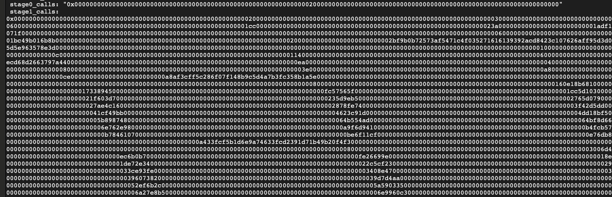

# v30.0 → v30.1 Rollup Upgrade (Ecosystem & Chain)

Area: Upgrade
Created by: Mykhailo Slyvka
Edited at: January 21, 2026 10:28 AM
Type: Tutorial
Status: Done

This document is mainly created with the reference to MatterLab’s original upgrade guide ([link to doc](https://www.notion.so/2d1a48363f2380a0b3a8fa4b459878e5?pvs=21)) , but cover every command.

Important!
This upgrade in heavily rely on config file that is created during the earlier upgrade (v29-v30). In current config upgrade we need to set a lot of data that could be taken only (I think so) from `v30.0-ecosystem.toml` .

# Step 0. Stop server with version v0.12.*, contracts version v0.30.0 and execution version 5

At the very beginning you need to stop sequencer **AFTER it processed all existing batches**. So there are no pending blocks, transactions or batches. You can set `sequencer_max_blocks_to_produce=0` so no new blocks will be created, restart server and wait some time so we are sure that state is finalized.

# Step 1. Prepare upgrade config

1. **Clone era-contracts repo and switch to branch with upgrade script  - `vb-v30.1-upgrade`.**

```bash
git clone https://github.com/matter-labs/era-contracts.git
cd era-contracts
git checkout vb-v30.1-upgrade
git submodule update --init --recursive
```

1. Fix the `remappings.txt`

    ```bash

    cd l1-contracts
    # Remove any existing erc4626-tests remapping (correct or incorrect)
    sed -i '/^erc4626-tests=/d' remappings.txt
    # Add the correct remapping at the end
    echo >> remappings.txt
    echo "erc4626-tests/=lib/openzeppelin-contracts-upgradeable-v4/lib/erc4626-tests/" >> remappings.txt

    ```

2. Build smart contracts:

    ```bash
    yarn install && yarn build:foundry && cd ..
    cd system-contracts && yarn install && yarn build && cd ..
    cd da-contracts && forge build && cd ..
    cd l1-contracts
    ```

3. **Create Upgrade Input TOML file.**
Copy the file below and then we will change fields. In this upgrade we need to change a lot of fields, so commands how to get proper values will be in next step.

    Save the file with path `era-contracts/l1-contracts/upgrade-envs/v0.30.1-airbender-fix/chain.toml`.


```bash
# in the l1-contracts dir
vi upgrade-envs/v0.30.1-airbender-fix/chain.toml
```

```bash
era_chain_id = 324 # CHANGE THIS
testnet_verifier = false # CHANGE THIS
# Unused
governance_upgrade_timer_initial_delay = 0
# Note, that this is NOT the owner of the bridgehub, but the owner of the zksync os CTM - usually ecosystem governance smart contract "governance_addr"
owner_address = "0xc66f0b45c05cf654eec093650fd67865e85e8566" # CHANGE THIS

# This should always be false for non-loadtest environments.
support_l2_legacy_shared_bridge_test = false

old_protocol_version = "0x1e00000000"  # No need to change this becauase we are doing upgrade from v0.30.0 to v0.30.1

priority_txs_l2_gas_limit = 2000000
max_expected_l1_gas_price = 30000000000
is_zk_sync_os = true
redeploy_da_manager = true

[contracts]
governance_min_delay = 0

max_number_of_chains = 100
create2_factory_salt = "0x3000000000000000000000000000000000000000000000000000001e00000001" # CHANGE THIS
create2_factory_addr = "0x4e59b44847b379578588920cA78FbF26c0B4956C" # CHANGE THIS
validator_timelock_execution_delay = 0
genesis_root = "0x423c107626aff95d3d086eabd92132dc9485e021ae3cb4c7735d5e963578e3d0" # we use genesis root from genesis v5
genesis_rollup_leaf_index = 0
genesis_batch_commitment = "0000000000000000000000000000000000000000000000000000000000000001"
recursion_node_level_vk_hash = "0x0000000000000000000000000000000000000000000000000000000000000000"
recursion_leaf_level_vk_hash = "0x0000000000000000000000000000000000000000000000000000000000000000"
recursion_circuits_set_vks_hash = "0x0000000000000000000000000000000000000000000000000000000000000000"
priority_tx_max_gas_limit = 72000000
diamond_init_pubdata_pricing_mode = 0
diamond_init_batch_overhead_l1_gas = 1000000
diamond_init_max_pubdata_per_batch = 120000
diamond_init_max_l2_gas_per_batch = 80000000
diamond_init_priority_tx_max_pubdata = 99000
diamond_init_minimal_l2_gas_price = 250000000
bootloader_hash = "0x0000000000000000000000000000000000000000000000000000000000000001"
default_aa_hash = "0x0000000000000000000000000000000000000000000000000000000000000001"
evm_emulator_hash = "0x0000000000000000000000000000000000000000000000000000000000000001"
bridgehub_proxy_address = "0x303a465B659cBB0ab36eE643eA362c509EEb5213" # CHANGE THIS
# Does not matter, a new one should be deployed
rollup_da_manager = "0xE689e79a06D3D09f99C21E534cCF6a8b7C9b3C45"

# Does not matter
governance_security_council_address = "0xed04b1ac422251851a3EC953Ff4395e5c2443647"

latest_protocol_version = 0x1e00000001

# Unused as bytecode supplier is not supported in this upgrade.
l1_bytecodes_supplier_addr = "0xC9F20FC268Fc3e0e597660550033Bf2C24218fd8"

# Unused, since the upgrade is done for the ecosystem.
protocol_upgrade_handler_proxy_address = "0xE30Dca3047B37dc7d88849dE4A4Dc07937ad5Ab3"
protocol_upgrade_handler_implementation_address = "0x36625Bd3dDB469377C6e9893712158cA3c0cC14B"

[tokens]
token_weth_address = "0xc02aaa39b223fe8d0a0e5c4f27ead9083c756cc2" # This is Sepolia, 0xC02aaA39b223FE8D0A0e5C4F27eAD9083C756Cc2 - for Mainnet, zeros for dev chains

[gateway]
chain_id = 324 # CHANGE THIS

[state_transition]
admin_facet_addr = "0xa8AF3cfF5c286F07f148b9C5d4A7b3fC358b1A5E" # CHANGE THIS
diamond_init_addr = "0x77E0EAf7220783b372eB694ceCd68d2663797A44" # CHANGE THIS
executor_facet_addr = "0xd9232796Ee7AD3d8eB38BeF3a0c1eAF30De9d292" # CHANGE THIS
genesis_upgrade_addr = "0x2bf9B0B72573af5471c4f035271616139392Acd8" # CHANGE THIS
getters_facet_addr = "0xa433FcF5b1d6E9a74633fcd2391D71B49B20F4F3" # CHANGE THIS
mailbox_facet_addr = "0x883E3226558C7e0A1A6586003975DBcc226E7274" # CHANGE THIS
force_deployments_data = "0x0000000000000000000000000000000000000000000000000000000000000020000000000000000000000000000000000000000000000000000000000000000100000000000000000000000000000000000000000000000000000000000001440000000000000000000000008829ad80e425c646dab305381ff105169feece56010000f1477ebc7355591c664c501757b31e9cd0025d565546fc0054f28a6411000000000000000000000000d7800b45c05cf654eec093650fd67865e85e9677000000000000000000000000000000000000000000000000000000000000006400000000000000000000000000000000000000000000000000000000000001e0000000000000000000000000000000000000000000000000000000000000034000000000000000000000000000000000000000000000000000000000000004a00000000000000000000000000000000000000000000000000000000000000600000000000000000000000000000000000000000000000000000000000000076000000000000000000000000000000000000000000000000000000000000008c00000000000000000000000000000000000000000000000000000000000000000000000000000000000000000000000000000000000000000000000000000000000000000000000000000000000000000000000000000000000000000000000000000000000000000000000000000000000000000000000000000000000000140000000000000000000000000000000000000000000000000000000000000004000000000000000000000000000000000000000000000000000000000000000c000000000000000000000000000000000000000000000000000000000000000604cdf52a9a78024a7b5b1d31faa6de33eb6159ee71f02733c27de62106cb3d9ee00000000000000000000000000000000000000000000000000000000000030831dc8d8d6c1eb16ade1b790365a9007a3ca7247ee7de00b576b43e21d28918f9d0000000000000000000000000000000000000000000000000000000000000060b09a95cb43a3f5d388e945b68f8b8a814681d60e8252ed08cba7a3d591a152df0000000000000000000000000000000000000000000000000000000000000e0b09301da5bbb08e078e7a51cdb957dd25945efd0ec3b056137d344c929ecdc9c30000000000000000000000000000000000000000000000000000000000000140000000000000000000000000000000000000000000000000000000000000004000000000000000000000000000000000000000000000000000000000000000c000000000000000000000000000000000000000000000000000000000000000601c085665f2a51715c66b88f52f86f081e01bb941faf55d5fa9dbd6fe97cd683a0000000000000000000000000000000000000000000000000000000000002c5b5ad3d9403af0d911ee4aeadbbde9c353814fdbc7679c20c99f5f944c43f1dee00000000000000000000000000000000000000000000000000000000000000060b09a95cb43a3f5d388e945b68f8b8a814681d60e8252ed08cba7a3d591a152df0000000000000000000000000000000000000000000000000000000000000e0b09301da5bbb08e078e7a51cdb957dd25945efd0ec3b056137d344c929ecdc9c30000000000000000000000000000000000000000000000000000000000000140000000000000000000000000000000000000000000000000000000000000004000000000000000000000000000000000000000000000000000000000000000c000000000000000000000000000000000000000000000000000000000000000606dac35ffb85d51f76e2de0febb2b0f92ee424e38d51f8401773c17687a595d1c0000000000000000000000000000000000000000000000000000000000004580346683d96f68106a10b9f36edea22e1189e45255e05dd465c6d101ea2a360ab90000000000000000000000000000000000000000000000000000000000000060b09a95cb43a3f5d388e945b68f8b8a814681d60e8252ed08cba7a3d591a152df0000000000000000000000000000000000000000000000000000000000000e0b09301da5bbb08e078e7a51cdb957dd25945efd0ec3b056137d344c929ecdc9c30000000000000000000000000000000000000000000000000000000000000140000000000000000000000000000000000000000000000000000000000000004000000000000000000000000000000000000000000000000000000000000000c000000000000000000000000000000000000000000000000000000000000000609df14aba83ab80ad0df8cd4146b743788f4fcf00d4c8e636040081d44497e639000000000000000000000000000000000000000000000000000000000000183d5865ccbc7d551fc1802e091886ffa94586436778d22ce646d4bcb392360df5c00000000000000000000000000000000000000000000000000000000000000060b09a95cb43a3f5d388e945b68f8b8a814681d60e8252ed08cba7a3d591a152df0000000000000000000000000000000000000000000000000000000000000e0b09301da5bbb08e078e7a51cdb957dd25945efd0ec3b056137d344c929ecdc9c30000000000000000000000000000000000000000000000000000000000000140000000000000000000000000000000000000000000000000000000000000004000000000000000000000000000000000000000000000000000000000000000c000000000000000000000000000000000000000000000000000000000000000601a36318670b6ab973e68178a10d6107227fde6d027573d7668e61760d22a867a00000000000000000000000000000000000000000000000000000000000020064d5c32f28646ef26d746e078bd9d9c5797178e9959013bc13ec4ed42122d60220000000000000000000000000000000000000000000000000000000000000060b09a95cb43a3f5d388e945b68f8b8a814681d60e8252ed08cba7a3d591a152df0000000000000000000000000000000000000000000000000000000000000e0b09301da5bbb08e078e7a51cdb957dd25945efd0ec3b056137d344c929ecdc9c30000000000000000000000000000000000000000000000000000000000000140000000000000000000000000000000000000000000000000000000000000004000000000000000000000000000000000000000000000000000000000000000c00000000000000000000000000000000000000000000000000000000000000060c49018245ed5bebb0e9124546c1716a564864c451ec6e65931cc80bbe5400cc60000000000000000000000000000000000000000000000000000000000003a13db0d981bf1867108c27f2c52334c4f31d8bb88e17f6955ce85930568086974600000000000000000000000000000000000000000000000000000000000000060b09a95cb43a3f5d388e945b68f8b8a814681d60e8252ed08cba7a3d591a152df0000000000000000000000000000000000000000000000000000000000000e0b09301da5bbb08e078e7a51cdb957dd25945efd0ec3b056137d344c929ecdc9c3" # CHANGE THIS

# On mainnet there are no existing zksync os chain, thus no operations that use it are available.
# I.e. chains will not be able to upgrade from v29.1, but it is okay, since there
# are no such chains in the first place.
[zksync_os]
sample_chain_id = 324 # CHANGE THIS
# Unlike stage or testnet, there is no sample chain to get the CTM from, so
# we have to provide it explicitly.
**optional_ctm_address** = "0x1adf137f59949c9081157d5de1e002d1c992071f" # CHANGE THIS
current_dual_verifier = "0x5B4b58a5e65a0C4A054E0f4B67277a1bc6425bD2" # CHANGE THIS, use `cast call $DIAMOND "getVerifier()(address)" --rpc-url $RPC`  !!!

# we do not have gateway so no need to pass this values
[gateway.gateway_state_transition]
chain_type_manager_proxy_addr = "0x0000000000000000000000000000000000000000"
rollup_da_manager = "0x0000000000000000000000000000000000000000"
chain_type_manager_proxy_admin = "0x0000000000000000000000000000000000000000"
rollup_sl_da_validator = "0x0000000000000000000000000000000000000000"

```

1. **Change required fields in config.**

Prepare with adding envs, some values we will get from L1.

```bash
# CHANGE THIS VALUES
RPC=http://127.0.0.1:8545 # L1
BRIDGEHUB=0x0d09cfd4845fee189d9d15f4960fd8d202ea6ecc
CHAIN_ID=555

# JUST COPY COMMANDS, do not edit them
CTM=$(cast call $BRIDGEHUB "chainTypeManager(uint256)(address)" $CHAIN_ID --rpc-url $RPC)
OWNER_ADDRESS=$(cast call $CTM "owner()(address)" --rpc-url $RPC)
DIAMOND=$(cast call $BRIDGEHUB "getZKChain(uint256)(address)" $CHAIN_ID --rpc-url $RPC)
```

Edit such fields in config toml file:

- **era_chain_id** - change to your chain ID
- **testnet_verifier** - set true, if you use fake proofs, e.g. do not use real provers instead of fake
- **owner_address** - ecosystem governance smrt contract, to get it run:

```bash
echo $OWNER_ADDRESS
```

- **create2_factory_salt** - create2 salt (could be taken from `contracts.yaml` or random 32 bytes hash)

```bash
# NOTE: Change contracts.yaml path
grep "create2_factory_salt:" configs/contracts.yaml | grep -oP '0x[a-fA-F0-9]+'
```

- **create2_factory_addr** - create2 smart contract address (could be taken from `contracts.yaml` )

```bash
# NOTE: Change contracts.yaml path
grep "create2_factory_addr:" configs/contracts.yaml | grep -oP '0x[a-fA-F0-9]{40}'
```

- **bridgehub_proxy_address** - set your bridgehub address

```bash
echo $BRIDGEHUB
```

- **chain_id** - change to your chain ID
- **admin_facet_addr, diamond_init_addr, executor_facet_addr, genesis_upgrade_addr, getters_facet_addr, mailbox_facet_addr, force_deployments_data** - All these addresses and `force_deployments_data` must be taken from output file from previous upgrade, like  `v30-ecosystem.toml` , so you need to save it in your local dir.

```bash
# COPY FILE to local dir before
YAML_FILE="./upgrade-envs/v0.30.0-zksync-os-blobs/output/adi/v30.0-ecosystem.yaml"

# admin facet address
grep "admin_facet_addr:" "$YAML_FILE" | grep -v "0x0000000000000000000000000000000000000000" | head -1 | grep -oP '0x[a-fA-F0-9]{40}'
# diamond init address
grep "diamond_init_addr:" "$YAML_FILE" | grep -v "0x0000000000000000000000000000000000000000" | head -1 | grep -oP '0x[a-fA-F0-9]{40}'
# executor facet address
grep "executor_facet_addr:" "$YAML_FILE" | grep -v "0x0000000000000000000000000000000000000000" | head -1 | grep -oP '0x[a-fA-F0-9]{40}'
# genesis upgrade address
grep "genesis_upgrade_addr:" "$YAML_FILE" | grep -v "0x0000000000000000000000000000000000000000" | head -1 | grep -oP '0x[a-fA-F0-9]{40}'
# getters facet address
grep "getters_facet_addr:" "$YAML_FILE" | grep -v "0x0000000000000000000000000000000000000000" | head -1 | grep -oP '0x[a-fA-F0-9]{40}'
# mailbox facet address
grep "mailbox_facet_addr:" "$YAML_FILE" | grep -v "0x0000000000000000000000000000000000000000" | head -1 | grep -oP '0x[a-fA-F0-9]{40}'
# force deployment data
grep "force_deployments_data:" "$YAML_FILE" | grep "0x" | head -1 | sed 's/.*: "//' | sed 's/"$//'
```

- **sample_chain_id** - change to your chain ID
- **optional_ctm_address** - CTM address

```bash
echo $CTM
```

- **current_dual_verifier** - current dual verifier address

```bash
cast call $DIAMOND "getVerifier()(address)" --rpc-url $RPC
```

# Step 2. L1 Ecosystem Upgrade → `v30.1-ecosystem.yaml`

1. You may need to fix the `l1-contracts/foundry.toml` first:

    ```bash
    sed -i.bak 's/{ access = "read", path = "\.\.\/l1-contracts\/script-out\/" }/{ access = "read-write", path = "..\/l1-contracts\/script-out\/" }/' foundry.toml
    ```

    *It resolves an error “Error: script failed: vm.writeToml: the path script-out/v30.1-ecosystem.toml is not allowed to be accessed for write operations”*

2. Simulate the deployment (simulates transactions, outputs the upgrade data, i.e. required addresses, config addresses, protocol version and the Diamond Cuts). Note: some file names are different for other upgrades. You can use any private key as deployer, because ownership will be transfered during the upgrade.

```bash
DEPLOYER_PK={Deployer Private Key}

UPGRADE_ECOSYSTEM_INPUT=/upgrade-envs/v0.30.1-airbender-fix/chain.toml UPGRADE_ECOSYSTEM_OUTPUT=/script-out/v30.1-ecosystem.toml forge script ./deploy-scripts/upgrade/EcosystemUpgrade_v30_1_zk_os.s.sol --ffi --rpc-url $RPC --private-key $DEPLOYER_PK

```

This will create a file `./script-out/v30-ecosystem.toml` that will include new addresses of contracts that will be deployed for chain.

<aside>
⚠️

If you didn’t change `create2_factory_salt` (or do use the same {Deployer PK}) for the second ecosystem upgrade, you’ll get *errors* because the upgrade process creates smart contracts using `create2` which derives addresses deterministically from the deployer PK.

</aside>

<aside>
ℹ️

Use  `--fork-block-number 10034460` to test pre-update state of some unsuccessful update.

</aside>

1. 🚀 Run (`—broadcast`) the deployment/calldata preparation script. Note: you can use any private key, all ownership will be transfered to proper owners.

    ```bash
    UPGRADE_ECOSYSTEM_INPUT=/upgrade-envs/v0.30.1-airbender-fix/chain.toml UPGRADE_ECOSYSTEM_OUTPUT=/script-out/v30.1-ecosystem.toml forge script ./deploy-scripts/upgrade/EcosystemUpgrade_v30_1_zk_os.s.sol --ffi --rpc-url $RPC --with-gas-price 1000000000 --private-key $DEPLOYER_PK --broadcast
    ```


1. 🚀 Generate the YAML file for the upgrade (generating calldata). IMPORTANT: change file/dir autogenerated names.  like `31337/run-latest.json` (it’s *<chain ID>/run-latest.json*)

```bash
UPGRADE_ECOSYSTEM_OUTPUT=script-out/v30.1-ecosystem.toml UPGRADE_ECOSYSTEM_OUTPUT_TRANSACTIONS=./broadcast/EcosystemUpgrade_v30_1_zk_os.s.sol/11155111/run-latest.json YAML_OUTPUT_FILE=script-out/v30.1-ecosystem.yaml yarn upgrade-yaml-output-generator

```

# Step 3. L1 Upgrade: calldata → Governor

1. (Optional) Save logs (recommended for easier troubleshooting)
    1. move `script-out/v30.1-ecosystem.yaml` to `upgrade-envs/v0.30.1-airbender-fix/output/{your_network}/v30.1-ecosystem.yaml`
    2. move `broadcast/EcosystemUpgrade_v30_1_zk_os.s.sol/{l1_chain_id}/run-latest.json` to `upgrade-envs/v0.30.1-airbender-fix/output/{your_network}/run-latest.json`

    ```bash
    mkdir upgrade-envs/v0.30.1-airbender-fix/output/adi
    cp script-out/v30.1-ecosystem.yaml upgrade-envs/v0.30.1-airbender-fix/output/adi/v30.1-ecosystem.yaml
    cp script-out/v30.1-ecosystem.toml upgrade-envs/v0.30.1-airbender-fix/output/adi/v30.1-ecosystem.toml
    cp broadcast/EcosystemUpgrade_v30_1_zk_os.s.sol/31337/run-latest.json upgrade-envs/v0.30.1-airbender-fix/output/adi/run-latest.json
    ```

2. Transform calls to calldata
    - From all the generated data, we are only interested in the `stage1_calls` field from `v30.1-ecosystem.yaml` or `v30.1-ecosystem.toml`.

        

        `stage1_calls` is not a final calldata but rather a list of calls that can be transformed into calldata.

        Extract them:

        ```bash
        export STAGE1_CALLS="$(sed -nE 's/.*stage1_calls = "(0x[0-9a-fA-F]+)".*/\1/p' script-out/v30.1-ecosystem.toml)"
        ```

    - Copy the file below and create a file from it.
    - script:

        [encode_calls.py](artifacts/encode_calls.py)

    - Example Usage

    ```bash
    sudo apt install python3-pip
    pip3 install eth-abi "eth-hash[pycryptodome]" # --break-system-packages

    nano encode_calls.py # insert file data
    python3 encode_calls.py --calls-encoded $STAGE1_CALLS > calls_encoded.txt
    ```

    - Output Example

        ```jsx
        scheduleTransparent signature: scheduleTransparent(((address,uint256,bytes)[],bytes32,bytes32),uint256)
        scheduleTransparent selector:  0x2c431917
        scheduleTransparent calldata:  0x2c43191700000000000000000000000000000000000000000000000000000000000000400000000000000000000000000000000000000000000000000000000000000000000000000000000000000000000000000000000000000000000000000000006000000000000000000000000000000000000000000000000000000000000000000000000000000000000000000000000000000000000000000000000000000000000000000000000000000000000000000000000000000000000000000000000300000000000000000000000000000000000000000000000000000000000000600000000000000000000000000000000000000000000000000000000000001cc000000000000000000000000000000000000000000000000000000000000023a00000000000000000000000001adf137f59949c9081157d5de1e002d1c992071f000000000000000000000000000000000000000000000000000000000000000000000000000000000000000000000000000000000000000000000000000000600000000000000000000000000000000000000000000000000000000000001bc49b016b8b00000000000000000000000000000000000000000000000000000000000000200000000000000000000000002bf9b0b72573af5471c4f035271616139392acd8423c107626aff95d3d086eabd92132dc9485e021ae3cb4c7735d5e963578e3d00000000000000000000000000000000000000000000000000000000000000000000000000000000000000000000000000000000000000000000000000000000100000000000000000000000000000000000000000000000000000000000000c00000000000000000000000000000000000000000000000000000000000001140000000000000000000000000000000000000000000000000000000000000006000000000000000000000000077e0eaf7220783b372eb694cecd68d2663797a440000000000000000000000000000000000000000000000000000000000000ea00000000000000000000000000000000000000000000000000000000000000004000000000000000000000000000000000000000000000000000000000000008000000000000000000000000000000000000000000000000000000000000003e00000000000000000000000000000000000000000000000000000000000000a800000000000000000000000000000000000000000000000000000000000000ce0000000000000000000000000a8af3cff5c286f07f148b9c5d4a7b3fc358b1a5e00000000000000000000000000000000000000000000000000000000000000000000000000000000000000000000000000000000000000000000000000000000000000000000000000000000000000000000000000000000000000000000008000000000000000000000000000000000000000000000000000000000000000160e18b681000000000000000000000000000000000000000000000000000000001733894500000000000000000000000000000000000000000000000000000000fc57565f000000000000000000000000000000000000000000000000000000001cc5d1030000000000000000000000000000000000000000000000000000000021f603d700000000000000000000000000000000000000000000000000000000235d9eb5000000000000000000000000000000000000000000000000000000002765d0790000000000000000000000000000000000000000000000000000000027ae4c16000000000000000000000000000000000000000000000000000000002878fe74000000000000000000000000000000000000000000000000000000003f42d5dd0000000000000000000000000000000000000000000000000000000041cf49bb000000000000000000000000000000000000000000000000000000004623c91d000000000000000000000000000000000000000000000000000000004dd18bf5000000000000000000000000000000000000000000000000000000005b8987480000000000000000000000000000000000000000000000000000000064b554ad0000000000000000000000000000000000000000000000000000000064bf8d66000000000000000000000000000000000000000000000000000000006e762e9800000000000000000000000000000000000000000000000000000000a9f6d94100000000000000000000000000000000000000000000000000000000b4fcb57700000000000000000000000000000000000000000000000000000000b784610700000000000000000000000000000000000000000000000000000000be6f11cf00000000000000000000000000000000000000000000000000000000e76db86500000000000000000000000000000000000000000000000000000000000000000000000000000000a433fcf5b1d6e9a74633fcd2391d71b49b20f4f3000000000000000000000000000000000000000000000000000000000000000000000000000000000000000000000000000000000000000000000000000000000000000000000000000000000000000000000000000000000000000000000080000000000000000000000000000000000000000000000000000000000000003006d49e5b000000000000000000000000000000000000000000000000000000000ec6b0b700000000000000000000000000000000000000000000000000000000fe26699e0000000000000000000000000000000000000000000000000000000018e3a941000000000000000000000000000000000000000000000000000000001de72e340000000000000000000000000000000000000000000000000000000022c5cf230000000000000000000000000000000000000000000000000000000029b98c670000000000000000000000000000000000000000000000000000000033ce93fe000000000000000000000000000000000000000000000000000000003408e470000000000000000000000000000000000000000000000000000000003591c1a000000000000000000000000000000000000000000000000000000000396073820000000000000000000000000000000000000000000000000000000039d7d4aa0000000000000000000000000000000000000000000000000000000046657fe90000000000000000000000000000000000000000000000000000000052ef6b2c000000000000000000000000000000000000000000000000000000005a59033500000000000000000000000000000000000000000000000000000000631f4bac000000000000000000000000000000000000000000000000000000006a27e8b5000000000000000000000000000000000000000000000000000000006e9960c30000000000000000000000000000000000000000000000000000000074f4d30d0000000000000000000000000000000000000000000000000000000079823c9a000000000000000000000000000000000000000000000000000000007a0ed627000000000000000000000000000000000000000000000000000000007b30c8da000000000000000000000000000000000000000000000000000000008708474e00000000000000000000000000000000000000000000000000000000946ebad100000000000000000000000000000000000000000000000000000000960dcf240000000000000000000000000000000000000000000000000000000098acd7a6000000000000000000000000000000000000000000000000000000009cd939e4000000000000000000000000000000000000000000000000000000009d1b5a8100000000000000000000000000000000000000000000000000000000a1954fc500000000000000000000000000000000000000000000000000000000adfca15e00000000000000000000000000000000000000000000000000000000af6a2dcd00000000000000000000000000000000000000000000000000000000b22dd78e00000000000000000000000000000000000000000000000000000000b8c2f66f00000000000000000000000000000000000000000000000000000000bd7c541200000000000000000000000000000000000000000000000000000000c3bbd2d700000000000000000000000000000000000000000000000000000000cdffacc600000000000000000000000000000000000000000000000000000000d046815600000000000000000000000000000000000000000000000000000000d86970d800000000000000000000000000000000000000000000000000000000db1f0bf900000000000000000000000000000000000000000000000000000000dd655bb000000000000000000000000000000000000000000000000000000000e5355c7500000000000000000000000000000000000000000000000000000000e81e0ba100000000000000000000000000000000000000000000000000000000ea6c029c00000000000000000000000000000000000000000000000000000000ef3f0bae00000000000000000000000000000000000000000000000000000000f4ff5e2e00000000000000000000000000000000000000000000000000000000f5c1182c00000000000000000000000000000000000000000000000000000000facd743b00000000000000000000000000000000000000000000000000000000fd791f3c00000000000000000000000000000000000000000000000000000000000000000000000000000000883e3226558c7e0a1a6586003975dbcc226e7274000000000000000000000000000000000000000000000000000000000000000000000000000000000000000000000000000000000000000000000000000000010000000000000000000000000000000000000000000000000000000000000080000000000000000000000000000000000000000000000000000000000000000e042901c70000000000000000000000000000000000000000000000000000000012f43dab00000000000000000000000000000000000000000000000000000000eb6724190000000000000000000000000000000000000000000000000000000018b7fc2200000000000000000000000000000000000000000000000000000000263b7f8e000000000000000000000000000000000000000000000000000000006c0960f90000000000000000000000000000000000000000000000000000000079cf6165000000000000000000000000000000000000000000000000000000007efda2ae00000000000000000000000000000000000000000000000000000000b473318e00000000000000000000000000000000000000000000000000000000d077255100000000000000000000000000000000000000000000000000000000d07b90d100000000000000000000000000000000000000000000000000000000ddcc9eec00000000000000000000000000000000000000000000000000000000e4948f4300000000000000000000000000000000000000000000000000000000e896760d00000000000000000000000000000000000000000000000000000000000000000000000000000000d9232796ee7ad3d8eb38bef3a0c1eaf30de9d29200000000000000000000000000000000000000000000000000000000000000000000000000000000000000000000000000000000000000000000000000000001000000000000000000000000000000000000000000000000000000000000008000000000000000000000000000000000000000000000000000000000000000050b6db820000000000000000000000000000000000000000000000000000000000db9eb8700000000000000000000000000000000000000000000000000000000a085344d000000000000000000000000000000000000000000000000000000007ca4eff7000000000000000000000000000000000000000000000000000000009271e4500000000000000000000000000000000000000000000000000000000000000000000000000000000000000000000000000000000000000000000001c0000000000000000000000000da5e793b8ae713241d5cb681fd987704e59f745900000000000000000000000000000000000000000000000000000000000000000000000000000000000000000000000000000000000000000000000000000000000000000000000000000000000000000000000000000000000000000000000000000000000000000000000000000000000000000000000000000000000000010000000000000000000000000000000000000000000000000000000000000001000000000000000000000000000000000000000000000000000000000000000100000000000000000000000000000000000000000000000000000000044aa200000000000000000000000000000000000000000000000000000000000000000000000000000000000000000000000000000000000000000000000000000f4240000000000000000000000000000000000000000000000000000000000001d4c00000000000000000000000000000000000000000000000000000000004c4b40000000000000000000000000000000000000000000000000000000000000182b8000000000000000000000000000000000000000000000000000000000ee6b2800000000000000000000000000000000000000000000000000000000000000a400000000000000000000000000000000000000000000000000000000000000020000000000000000000000000000000000000000000000000000000000000000100000000000000000000000000000000000000000000000000000000000001440000000000000000000000008829ad80e425c646dab305381ff105169feece56010000f1477ebc7355591c664c501757b31e9cd0025d565546fc0054f28a6411000000000000000000000000d7800b45c05cf654eec093650fd67865e85e9677000000000000000000000000000000000000000000000000000000000000006400000000000000000000000000000000000000000000000000000000000001e0000000000000000000000000000000000000000000000000000000000000034000000000000000000000000000000000000000000000000000000000000004a00000000000000000000000000000000000000000000000000000000000000600000000000000000000000000000000000000000000000000000000000000076000000000000000000000000000000000000000000000000000000000000008c00000000000000000000000000000000000000000000000000000000000000000000000000000000000000000000000000000000000000000000000000000000000000000000000000000000000000000000000000000000000000000000000000000000000000000000000000000000000000000000000000000000000000140000000000000000000000000000000000000000000000000000000000000004000000000000000000000000000000000000000000000000000000000000000c000000000000000000000000000000000000000000000000000000000000000604cdf52a9a78024a7b5b1d31faa6de33eb6159ee71f02733c27de62106cb3d9ee00000000000000000000000000000000000000000000000000000000000030831dc8d8d6c1eb16ade1b790365a9007a3ca7247ee7de00b576b43e21d28918f9d0000000000000000000000000000000000000000000000000000000000000060b09a95cb43a3f5d388e945b68f8b8a814681d60e8252ed08cba7a3d591a152df0000000000000000000000000000000000000000000000000000000000000e0b09301da5bbb08e078e7a51cdb957dd25945efd0ec3b056137d344c929ecdc9c30000000000000000000000000000000000000000000000000000000000000140000000000000000000000000000000000000000000000000000000000000004000000000000000000000000000000000000000000000000000000000000000c000000000000000000000000000000000000000000000000000000000000000601c085665f2a51715c66b88f52f86f081e01bb941faf55d5fa9dbd6fe97cd683a0000000000000000000000000000000000000000000000000000000000002c5b5ad3d9403af0d911ee4aeadbbde9c353814fdbc7679c20c99f5f944c43f1dee00000000000000000000000000000000000000000000000000000000000000060b09a95cb43a3f5d388e945b68f8b8a814681d60e8252ed08cba7a3d591a152df0000000000000000000000000000000000000000000000000000000000000e0b09301da5bbb08e078e7a51cdb957dd25945efd0ec3b056137d344c929ecdc9c30000000000000000000000000000000000000000000000000000000000000140000000000000000000000000000000000000000000000000000000000000004000000000000000000000000000000000000000000000000000000000000000c000000000000000000000000000000000000000000000000000000000000000606dac35ffb85d51f76e2de0febb2b0f92ee424e38d51f8401773c17687a595d1c0000000000000000000000000000000000000000000000000000000000004580346683d96f68106a10b9f36edea22e1189e45255e05dd465c6d101ea2a360ab90000000000000000000000000000000000000000000000000000000000000060b09a95cb43a3f5d388e945b68f8b8a814681d60e8252ed08cba7a3d591a152df0000000000000000000000000000000000000000000000000000000000000e0b09301da5bbb08e078e7a51cdb957dd25945efd0ec3b056137d344c929ecdc9c30000000000000000000000000000000000000000000000000000000000000140000000000000000000000000000000000000000000000000000000000000004000000000000000000000000000000000000000000000000000000000000000c000000000000000000000000000000000000000000000000000000000000000609df14aba83ab80ad0df8cd4146b743788f4fcf00d4c8e636040081d44497e639000000000000000000000000000000000000000000000000000000000000183d5865ccbc7d551fc1802e091886ffa94586436778d22ce646d4bcb392360df5c00000000000000000000000000000000000000000000000000000000000000060b09a95cb43a3f5d388e945b68f8b8a814681d60e8252ed08cba7a3d591a152df0000000000000000000000000000000000000000000000000000000000000e0b09301da5bbb08e078e7a51cdb957dd25945efd0ec3b056137d344c929ecdc9c30000000000000000000000000000000000000000000000000000000000000140000000000000000000000000000000000000000000000000000000000000004000000000000000000000000000000000000000000000000000000000000000c000000000000000000000000000000000000000000000000000000000000000601a36318670b6ab973e68178a10d6107227fde6d027573d7668e61760d22a867a00000000000000000000000000000000000000000000000000000000000020064d5c32f28646ef26d746e078bd9d9c5797178e9959013bc13ec4ed42122d60220000000000000000000000000000000000000000000000000000000000000060b09a95cb43a3f5d388e945b68f8b8a814681d60e8252ed08cba7a3d591a152df0000000000000000000000000000000000000000000000000000000000000e0b09301da5bbb08e078e7a51cdb957dd25945efd0ec3b056137d344c929ecdc9c30000000000000000000000000000000000000000000000000000000000000140000000000000000000000000000000000000000000000000000000000000004000000000000000000000000000000000000000000000000000000000000000c00000000000000000000000000000000000000000000000000000000000000060c49018245ed5bebb0e9124546c1716a564864c451ec6e65931cc80bbe5400cc60000000000000000000000000000000000000000000000000000000000003a13db0d981bf1867108c27f2c52334c4f31d8bb88e17f6955ce85930568086974600000000000000000000000000000000000000000000000000000000000000060b09a95cb43a3f5d388e945b68f8b8a814681d60e8252ed08cba7a3d591a152df0000000000000000000000000000000000000000000000000000000000000e0b09301da5bbb08e078e7a51cdb957dd25945efd0ec3b056137d344c929ecdc9c3000000000000000000000000000000000000000000000000000000000000000000000000000000001adf137f59949c9081157d5de1e002d1c992071f0000000000000000000000000000000000000000000000000000000000000000000000000000000000000000000000000000000000000000000000000000006000000000000000000000000000000000000000000000000000000000000006442e52285100000000000000000000000000000000000000000000000000000000000000800000000000000000000000000000000000000000000000000000001e00000000ffffffffffffffffffffffffffffffffffffffffffffffffffffffffffffffff0000000000000000000000000000000000000000000000000000001e000000010000000000000000000000000000000000000000000000000000000000000060000000000000000000000000175a48b7d2d596d66d7b0dada23cf8909d8cfa2300000000000000000000000000000000000000000000000000000000000000800000000000000000000000000000000000000000000000000000000000000000000000000000000000000000000000000000000000000000000000000000050416ef130300000000000000000000000000000000000000000000000000000000000000200000000000000000000000000000000000000000000000000000000000000180000000000000000000000000000000000000000000000000000000000000000000000000000000000000000000000000000000000000000000000000000000000000000000000000000000000000000000000000000000000000000000000000000000000000000000000000da5e793b8ae713241d5cb681fd987704e59f745900000000000000000000000000000000000000000000000000000000000000000000000000000000000000000000000000000000000000000000000000000000000000000000000000000000000000000000000000000000000000000000000000000000000000000000000000000000000000000000000000000000000004a000000000000000000000000000000000000000000000000000000000000004c000000000000000000000000000000000000000000000000000000000000000000000000000000000000000000000000000000000000000000000001e00000001000000000000000000000000000000000000000000000000000000000000000000000000000000000000000000000000000000000000000000000000000000000000000000000000000000000000000000000000000000000000000000000000000000000000000000000000000000000000000000000000000000000000000000000000000000000000000000000000000000000000000000000000000000000000000000000000000000000000000000000000000000000000000000000000000000000000000000000000000000000000000000000000000000000000000000000000000000000000000000000000000000000000000000000000000000000000000000000000000000000000000000000000000000000000000000000000000000000000000000000000000000000000000000000000000000000000000000000000000000000000000000000000000000000000000000000000000000000000000000000000000000000000000000000000000000000000000000000000000000000000000000000000000000000000000000000000000000000000000000000000000000000000000000000000000000000000000000000000000000000000000000000000000000000000000000000000000000000000000000000260000000000000000000000000000000000000000000000000000000000000028000000000000000000000000000000000000000000000000000000000000002a000000000000000000000000000000000000000000000000000000000000002e00000000000000000000000000000000000000000000000000000000000000300000000000000000000000000000000000000000000000000000000000000000000000000000000000000000000000000000000000000000000000000000000000000000000000000000000000000000000000000000000000000000000000001000000000000000000000000000000000000000000000000000000000000000000000000000000000000000000000000000000000000000000000000000000000000000000000000000000000000000000000000000000000000000000000000000000000000000000000000000000000000000000000000000000000000000000000000000000000000000000000000000000000000000000000000000000000000000000000000000000000000000000000000000000000000000000000000000000000000000000000000000000000000000000000000000000000000000000000000da5e793b8ae713241d5cb681fd987704e59f745900000000000000000000000000000000000000000000000000000000000000000000000000000000000000000000000000000000000000000000000000000060000000000000000000000000000000000000000000000000000000000000000479ba509700000000000000000000000000000000000000000000000000000000

        execute signature:             execute(((address,uint256,bytes)[],bytes32,bytes32))
        execute selector:              0x74da756b
        execute calldata:              0x74da756b0000000000000000000000000000000000000000000000000000000000000020000000000000000000000000000000000000000000000000000000000000006000000000000000000000000000000000000000000000000000000000000000000000000000000000000000000000000000000000000000000000000000000000000000000000000000000000000000000000000000000000000000000000000300000000000000000000000000000000000000000000000000000000000000600000000000000000000000000000000000000000000000000000000000001cc000000000000000000000000000000000000000000000000000000000000023a00000000000000000000000001adf137f59949c9081157d5de1e002d1c992071f000000000000000000000000000000000000000000000000000000000000000000000000000000000000000000000000000000000000000000000000000000600000000000000000000000000000000000000000000000000000000000001bc49b016b8b00000000000000000000000000000000000000000000000000000000000000200000000000000000000000002bf9b0b72573af5471c4f035271616139392acd8423c107626aff95d3d086eabd92132dc9485e021ae3cb4c7735d5e963578e3d00000000000000000000000000000000000000000000000000000000000000000000000000000000000000000000000000000000000000000000000000000000100000000000000000000000000000000000000000000000000000000000000c00000000000000000000000000000000000000000000000000000000000001140000000000000000000000000000000000000000000000000000000000000006000000000000000000000000077e0eaf7220783b372eb694cecd68d2663797a440000000000000000000000000000000000000000000000000000000000000ea00000000000000000000000000000000000000000000000000000000000000004000000000000000000000000000000000000000000000000000000000000008000000000000000000000000000000000000000000000000000000000000003e00000000000000000000000000000000000000000000000000000000000000a800000000000000000000000000000000000000000000000000000000000000ce0000000000000000000000000a8af3cff5c286f07f148b9c5d4a7b3fc358b1a5e00000000000000000000000000000000000000000000000000000000000000000000000000000000000000000000000000000000000000000000000000000000000000000000000000000000000000000000000000000000000000000000008000000000000000000000000000000000000000000000000000000000000000160e18b681000000000000000000000000000000000000000000000000000000001733894500000000000000000000000000000000000000000000000000000000fc57565f000000000000000000000000000000000000000000000000000000001cc5d1030000000000000000000000000000000000000000000000000000000021f603d700000000000000000000000000000000000000000000000000000000235d9eb5000000000000000000000000000000000000000000000000000000002765d0790000000000000000000000000000000000000000000000000000000027ae4c16000000000000000000000000000000000000000000000000000000002878fe74000000000000000000000000000000000000000000000000000000003f42d5dd0000000000000000000000000000000000000000000000000000000041cf49bb000000000000000000000000000000000000000000000000000000004623c91d000000000000000000000000000000000000000000000000000000004dd18bf5000000000000000000000000000000000000000000000000000000005b8987480000000000000000000000000000000000000000000000000000000064b554ad0000000000000000000000000000000000000000000000000000000064bf8d66000000000000000000000000000000000000000000000000000000006e762e9800000000000000000000000000000000000000000000000000000000a9f6d94100000000000000000000000000000000000000000000000000000000b4fcb57700000000000000000000000000000000000000000000000000000000b784610700000000000000000000000000000000000000000000000000000000be6f11cf00000000000000000000000000000000000000000000000000000000e76db86500000000000000000000000000000000000000000000000000000000000000000000000000000000a433fcf5b1d6e9a74633fcd2391d71b49b20f4f3000000000000000000000000000000000000000000000000000000000000000000000000000000000000000000000000000000000000000000000000000000000000000000000000000000000000000000000000000000000000000000000080000000000000000000000000000000000000000000000000000000000000003006d49e5b000000000000000000000000000000000000000000000000000000000ec6b0b700000000000000000000000000000000000000000000000000000000fe26699e0000000000000000000000000000000000000000000000000000000018e3a941000000000000000000000000000000000000000000000000000000001de72e340000000000000000000000000000000000000000000000000000000022c5cf230000000000000000000000000000000000000000000000000000000029b98c670000000000000000000000000000000000000000000000000000000033ce93fe000000000000000000000000000000000000000000000000000000003408e470000000000000000000000000000000000000000000000000000000003591c1a000000000000000000000000000000000000000000000000000000000396073820000000000000000000000000000000000000000000000000000000039d7d4aa0000000000000000000000000000000000000000000000000000000046657fe90000000000000000000000000000000000000000000000000000000052ef6b2c000000000000000000000000000000000000000000000000000000005a59033500000000000000000000000000000000000000000000000000000000631f4bac000000000000000000000000000000000000000000000000000000006a27e8b5000000000000000000000000000000000000000000000000000000006e9960c30000000000000000000000000000000000000000000000000000000074f4d30d0000000000000000000000000000000000000000000000000000000079823c9a000000000000000000000000000000000000000000000000000000007a0ed627000000000000000000000000000000000000000000000000000000007b30c8da000000000000000000000000000000000000000000000000000000008708474e00000000000000000000000000000000000000000000000000000000946ebad100000000000000000000000000000000000000000000000000000000960dcf240000000000000000000000000000000000000000000000000000000098acd7a6000000000000000000000000000000000000000000000000000000009cd939e4000000000000000000000000000000000000000000000000000000009d1b5a8100000000000000000000000000000000000000000000000000000000a1954fc500000000000000000000000000000000000000000000000000000000adfca15e00000000000000000000000000000000000000000000000000000000af6a2dcd00000000000000000000000000000000000000000000000000000000b22dd78e00000000000000000000000000000000000000000000000000000000b8c2f66f00000000000000000000000000000000000000000000000000000000bd7c541200000000000000000000000000000000000000000000000000000000c3bbd2d700000000000000000000000000000000000000000000000000000000cdffacc600000000000000000000000000000000000000000000000000000000d046815600000000000000000000000000000000000000000000000000000000d86970d800000000000000000000000000000000000000000000000000000000db1f0bf900000000000000000000000000000000000000000000000000000000dd655bb000000000000000000000000000000000000000000000000000000000e5355c7500000000000000000000000000000000000000000000000000000000e81e0ba100000000000000000000000000000000000000000000000000000000ea6c029c00000000000000000000000000000000000000000000000000000000ef3f0bae00000000000000000000000000000000000000000000000000000000f4ff5e2e00000000000000000000000000000000000000000000000000000000f5c1182c00000000000000000000000000000000000000000000000000000000facd743b00000000000000000000000000000000000000000000000000000000fd791f3c00000000000000000000000000000000000000000000000000000000000000000000000000000000883e3226558c7e0a1a6586003975dbcc226e7274000000000000000000000000000000000000000000000000000000000000000000000000000000000000000000000000000000000000000000000000000000010000000000000000000000000000000000000000000000000000000000000080000000000000000000000000000000000000000000000000000000000000000e042901c70000000000000000000000000000000000000000000000000000000012f43dab00000000000000000000000000000000000000000000000000000000eb6724190000000000000000000000000000000000000000000000000000000018b7fc2200000000000000000000000000000000000000000000000000000000263b7f8e000000000000000000000000000000000000000000000000000000006c0960f90000000000000000000000000000000000000000000000000000000079cf6165000000000000000000000000000000000000000000000000000000007efda2ae00000000000000000000000000000000000000000000000000000000b473318e00000000000000000000000000000000000000000000000000000000d077255100000000000000000000000000000000000000000000000000000000d07b90d100000000000000000000000000000000000000000000000000000000ddcc9eec00000000000000000000000000000000000000000000000000000000e4948f4300000000000000000000000000000000000000000000000000000000e896760d00000000000000000000000000000000000000000000000000000000000000000000000000000000d9232796ee7ad3d8eb38bef3a0c1eaf30de9d29200000000000000000000000000000000000000000000000000000000000000000000000000000000000000000000000000000000000000000000000000000001000000000000000000000000000000000000000000000000000000000000008000000000000000000000000000000000000000000000000000000000000000050b6db820000000000000000000000000000000000000000000000000000000000db9eb8700000000000000000000000000000000000000000000000000000000a085344d000000000000000000000000000000000000000000000000000000007ca4eff7000000000000000000000000000000000000000000000000000000009271e4500000000000000000000000000000000000000000000000000000000000000000000000000000000000000000000000000000000000000000000001c0000000000000000000000000da5e793b8ae713241d5cb681fd987704e59f745900000000000000000000000000000000000000000000000000000000000000000000000000000000000000000000000000000000000000000000000000000000000000000000000000000000000000000000000000000000000000000000000000000000000000000000000000000000000000000000000000000000000000010000000000000000000000000000000000000000000000000000000000000001000000000000000000000000000000000000000000000000000000000000000100000000000000000000000000000000000000000000000000000000044aa200000000000000000000000000000000000000000000000000000000000000000000000000000000000000000000000000000000000000000000000000000f4240000000000000000000000000000000000000000000000000000000000001d4c00000000000000000000000000000000000000000000000000000000004c4b40000000000000000000000000000000000000000000000000000000000000182b8000000000000000000000000000000000000000000000000000000000ee6b2800000000000000000000000000000000000000000000000000000000000000a400000000000000000000000000000000000000000000000000000000000000020000000000000000000000000000000000000000000000000000000000000000100000000000000000000000000000000000000000000000000000000000001440000000000000000000000008829ad80e425c646dab305381ff105169feece56010000f1477ebc7355591c664c501757b31e9cd0025d565546fc0054f28a6411000000000000000000000000d7800b45c05cf654eec093650fd67865e85e9677000000000000000000000000000000000000000000000000000000000000006400000000000000000000000000000000000000000000000000000000000001e0000000000000000000000000000000000000000000000000000000000000034000000000000000000000000000000000000000000000000000000000000004a00000000000000000000000000000000000000000000000000000000000000600000000000000000000000000000000000000000000000000000000000000076000000000000000000000000000000000000000000000000000000000000008c00000000000000000000000000000000000000000000000000000000000000000000000000000000000000000000000000000000000000000000000000000000000000000000000000000000000000000000000000000000000000000000000000000000000000000000000000000000000000000000000000000000000000140000000000000000000000000000000000000000000000000000000000000004000000000000000000000000000000000000000000000000000000000000000c000000000000000000000000000000000000000000000000000000000000000604cdf52a9a78024a7b5b1d31faa6de33eb6159ee71f02733c27de62106cb3d9ee00000000000000000000000000000000000000000000000000000000000030831dc8d8d6c1eb16ade1b790365a9007a3ca7247ee7de00b576b43e21d28918f9d0000000000000000000000000000000000000000000000000000000000000060b09a95cb43a3f5d388e945b68f8b8a814681d60e8252ed08cba7a3d591a152df0000000000000000000000000000000000000000000000000000000000000e0b09301da5bbb08e078e7a51cdb957dd25945efd0ec3b056137d344c929ecdc9c30000000000000000000000000000000000000000000000000000000000000140000000000000000000000000000000000000000000000000000000000000004000000000000000000000000000000000000000000000000000000000000000c000000000000000000000000000000000000000000000000000000000000000601c085665f2a51715c66b88f52f86f081e01bb941faf55d5fa9dbd6fe97cd683a0000000000000000000000000000000000000000000000000000000000002c5b5ad3d9403af0d911ee4aeadbbde9c353814fdbc7679c20c99f5f944c43f1dee00000000000000000000000000000000000000000000000000000000000000060b09a95cb43a3f5d388e945b68f8b8a814681d60e8252ed08cba7a3d591a152df0000000000000000000000000000000000000000000000000000000000000e0b09301da5bbb08e078e7a51cdb957dd25945efd0ec3b056137d344c929ecdc9c30000000000000000000000000000000000000000000000000000000000000140000000000000000000000000000000000000000000000000000000000000004000000000000000000000000000000000000000000000000000000000000000c000000000000000000000000000000000000000000000000000000000000000606dac35ffb85d51f76e2de0febb2b0f92ee424e38d51f8401773c17687a595d1c0000000000000000000000000000000000000000000000000000000000004580346683d96f68106a10b9f36edea22e1189e45255e05dd465c6d101ea2a360ab90000000000000000000000000000000000000000000000000000000000000060b09a95cb43a3f5d388e945b68f8b8a814681d60e8252ed08cba7a3d591a152df0000000000000000000000000000000000000000000000000000000000000e0b09301da5bbb08e078e7a51cdb957dd25945efd0ec3b056137d344c929ecdc9c30000000000000000000000000000000000000000000000000000000000000140000000000000000000000000000000000000000000000000000000000000004000000000000000000000000000000000000000000000000000000000000000c000000000000000000000000000000000000000000000000000000000000000609df14aba83ab80ad0df8cd4146b743788f4fcf00d4c8e636040081d44497e639000000000000000000000000000000000000000000000000000000000000183d5865ccbc7d551fc1802e091886ffa94586436778d22ce646d4bcb392360df5c00000000000000000000000000000000000000000000000000000000000000060b09a95cb43a3f5d388e945b68f8b8a814681d60e8252ed08cba7a3d591a152df0000000000000000000000000000000000000000000000000000000000000e0b09301da5bbb08e078e7a51cdb957dd25945efd0ec3b056137d344c929ecdc9c30000000000000000000000000000000000000000000000000000000000000140000000000000000000000000000000000000000000000000000000000000004000000000000000000000000000000000000000000000000000000000000000c000000000000000000000000000000000000000000000000000000000000000601a36318670b6ab973e68178a10d6107227fde6d027573d7668e61760d22a867a00000000000000000000000000000000000000000000000000000000000020064d5c32f28646ef26d746e078bd9d9c5797178e9959013bc13ec4ed42122d60220000000000000000000000000000000000000000000000000000000000000060b09a95cb43a3f5d388e945b68f8b8a814681d60e8252ed08cba7a3d591a152df0000000000000000000000000000000000000000000000000000000000000e0b09301da5bbb08e078e7a51cdb957dd25945efd0ec3b056137d344c929ecdc9c30000000000000000000000000000000000000000000000000000000000000140000000000000000000000000000000000000000000000000000000000000004000000000000000000000000000000000000000000000000000000000000000c00000000000000000000000000000000000000000000000000000000000000060c49018245ed5bebb0e9124546c1716a564864c451ec6e65931cc80bbe5400cc60000000000000000000000000000000000000000000000000000000000003a13db0d981bf1867108c27f2c52334c4f31d8bb88e17f6955ce85930568086974600000000000000000000000000000000000000000000000000000000000000060b09a95cb43a3f5d388e945b68f8b8a814681d60e8252ed08cba7a3d591a152df0000000000000000000000000000000000000000000000000000000000000e0b09301da5bbb08e078e7a51cdb957dd25945efd0ec3b056137d344c929ecdc9c3000000000000000000000000000000000000000000000000000000000000000000000000000000001adf137f59949c9081157d5de1e002d1c992071f0000000000000000000000000000000000000000000000000000000000000000000000000000000000000000000000000000000000000000000000000000006000000000000000000000000000000000000000000000000000000000000006442e52285100000000000000000000000000000000000000000000000000000000000000800000000000000000000000000000000000000000000000000000001e00000000ffffffffffffffffffffffffffffffffffffffffffffffffffffffffffffffff0000000000000000000000000000000000000000000000000000001e000000010000000000000000000000000000000000000000000000000000000000000060000000000000000000000000175a48b7d2d596d66d7b0dada23cf8909d8cfa2300000000000000000000000000000000000000000000000000000000000000800000000000000000000000000000000000000000000000000000000000000000000000000000000000000000000000000000000000000000000000000000050416ef130300000000000000000000000000000000000000000000000000000000000000200000000000000000000000000000000000000000000000000000000000000180000000000000000000000000000000000000000000000000000000000000000000000000000000000000000000000000000000000000000000000000000000000000000000000000000000000000000000000000000000000000000000000000000000000000000000000000da5e793b8ae713241d5cb681fd987704e59f745900000000000000000000000000000000000000000000000000000000000000000000000000000000000000000000000000000000000000000000000000000000000000000000000000000000000000000000000000000000000000000000000000000000000000000000000000000000000000000000000000000000000004a000000000000000000000000000000000000000000000000000000000000004c000000000000000000000000000000000000000000000000000000000000000000000000000000000000000000000000000000000000000000000001e00000001000000000000000000000000000000000000000000000000000000000000000000000000000000000000000000000000000000000000000000000000000000000000000000000000000000000000000000000000000000000000000000000000000000000000000000000000000000000000000000000000000000000000000000000000000000000000000000000000000000000000000000000000000000000000000000000000000000000000000000000000000000000000000000000000000000000000000000000000000000000000000000000000000000000000000000000000000000000000000000000000000000000000000000000000000000000000000000000000000000000000000000000000000000000000000000000000000000000000000000000000000000000000000000000000000000000000000000000000000000000000000000000000000000000000000000000000000000000000000000000000000000000000000000000000000000000000000000000000000000000000000000000000000000000000000000000000000000000000000000000000000000000000000000000000000000000000000000000000000000000000000000000000000000000000000000000000000000000000000000000260000000000000000000000000000000000000000000000000000000000000028000000000000000000000000000000000000000000000000000000000000002a000000000000000000000000000000000000000000000000000000000000002e00000000000000000000000000000000000000000000000000000000000000300000000000000000000000000000000000000000000000000000000000000000000000000000000000000000000000000000000000000000000000000000000000000000000000000000000000000000000000000000000000000000000000001000000000000000000000000000000000000000000000000000000000000000000000000000000000000000000000000000000000000000000000000000000000000000000000000000000000000000000000000000000000000000000000000000000000000000000000000000000000000000000000000000000000000000000000000000000000000000000000000000000000000000000000000000000000000000000000000000000000000000000000000000000000000000000000000000000000000000000000000000000000000000000000000000000000000000000000000da5e793b8ae713241d5cb681fd987704e59f745900000000000000000000000000000000000000000000000000000000000000000000000000000000000000000000000000000000000000000000000000000060000000000000000000000000000000000000000000000000000000000000000479ba509700000000000000000000000000000000000000000000000000000000
        ```

3. At the end you should receive two calldatas, you can now perform two calls:
    1. from: {ecosystem governor}, to: {ecosystem governance_contract}, calldata: {scheduleTransparent_calldata}

        ```bash
        export SCHEDULE_TRANSPARENT_CALLDATA="$(sed -nE 's/^scheduleTransparent calldata:[[:space:]]*(0x[0-9a-fA-F]+).*/\1/p' calls_encoded.txt)"
        ```

    2. from: {ecosystem governor}, to: {ecosystem governance_contract}, calldata: {execute_calldata}

        ```bash
        export EXECUTE_CALLDATA="$(sed -nE 's/^execute calldata:[[:space:]]*(0x[0-9a-fA-F]+).*/\1/p' calls_encoded.txt)"
        ```

4. 🚀 Execute via `cast call` or multisig.

```bash
GOVERNANCE=$(cast call $BRIDGEHUB "owner()(address)" --rpc-url $RPC)

# How to get an ecosystem governor owner
cast call $GOVERNANCE "owner()(address)" --rpc-url $RPC

# Find a private key in <ecosystem>/config/wallets.yaml
GOV_PK=0x123....

cast send $GOVERNANCE $SCHEDULE_TRANSPARENT_CALLDATA --private-key $GOV_PK --rpc-url $RPC --gas-limit 5000000
cast send $GOVERNANCE $EXECUTE_CALLDATA --private-key $GOV_PK --rpc-url $RPC --gas-limit 5000000
```

# Step 4. Execute Chain Upgrade

1. Install zkstack from the v30 branch

```bash
cd ../..
cargo install   --git https://github.com/matter-labs/zksync-era   --rev a48fd5f99a3fad0542b514fc9c508094230b35f4 --locked zkstack --force
```

1. Git clone zksync-era

```bash
git clone https://github.com/matter-labs/zksync-era.git zksync-era-v30.1
```

1. Clone `v30.1-ecosystem.yaml` to zksync-era dir

```bash
cd zksync-era-v30.1
cp ../era-contracts/l1-contracts/script-out/v30.1-ecosystem.yaml .
```

OR

```bash
cd <ecosystem>
cp ../era-contracts/l1-contracts/script-out/v30.1-ecosystem.yaml .
```

1. Generate calldata for chain upgrade

```bash
L2_RPC=http://127.0.0.1:3050

zkstack dev generate-chain-upgrade --upgrade-version v30-zk-sync-os-blobs ./v30.1-ecosystem.yaml $CHAIN_ID $CHAIN_ID $CHAIN_ID $RPC $L2_RPC $L2_RPC 0 --force-display-finalization-params=true 2>&1 | tee chain-upgrade.txt
```

1. At the end you need to execute two calldatas:
    1. `"description": "Calldata to schedule upgrade"` - from: {chain_admin_owner}, to: {chain_admin}, calldata: {schedule_calldata}

        ```bash
        export SCHEDULE_CALLDATA="$(sed -nE '/"description":[[:space:]]*"Calldata to schedule upgrade"/,/"value"/ s/.*"data":[[:space:]]*"([^"]+)".*/\1/p' chain-upgrade.txt | head -n1)"
        ```

    2. `Full calldata to call ChainAdmin with`  - from: {chain_admin_owner}, to: {chain_admin}, calldata: {full calldata}

        ```bash
        export CHAINADMIN_CALLDATA="0x$(sed -nE '/Full calldata to call `ChainAdmin` with/{n; s/^│[[:space:]]*([0-9a-fA-F]+).*/\1/p}' chain-upgrade.txt)"
        ```


```bash
DIAMOND=$(cast call $BRIDGEHUB "getZKChain(uint256)(address)" $CHAIN_ID --rpc-url $RPC)
CHAIN_ADMIN=$(cast call $DIAMOND "getAdmin()(address)" --rpc-url $RPC)
```

Get the {Chain Governor PK}:

```bash
cast call $CHAIN_ADMIN "owner()(address)" --rpc-url $RPC
```

`grep` a private key from the ecosystem folder and set to a var:

```bash
CHAIN_GOVERNOR_PK=0x123....
```

1. 🚀 Execute via `cast call` or multisig.

```bash
cast send $CHAIN_ADMIN $SCHEDULE_CALLDATA --private-key $CHAIN_GOVERNOR_PK --rpc-url $RPC --gas-limit 5000000
cast send $CHAIN_ADMIN $CHAINADMIN_CALLDATA --private-key $CHAIN_GOVERNOR_PK --rpc-url $RPC --gas-limit 5000000
```

1. (Optional) Check if upgrade was finished:

```bash
CTM=$(cast call $BRIDGEHUB "chainTypeManager(uint256)(address)" $CHAIN_ID --rpc-url $RPC )
DIAMOND=$(cast call $BRIDGEHUB  "getHyperchain(uint256)(address)" $CHAIN_ID --rpc-url $RPC )
cast call $CTM "protocolVersion()(uint256)" --rpc-url $RPC
# 128849018881 -> should return new protocol version if ecosystem is upgraded

cast call $CTM "upgradeCutHash(uint256)(bytes32)" 128849018880 --rpc-url $RPC
# 0x051c941bcb1335a492cbd17ff687434d0da9f1c39bf1e93aa9d2bd5eb486e87e -> must be non zero

cast call $DIAMOND "getProtocolVersion()(uint256)" --rpc-url $RPC
# 128849018881 -> should return new protocol version if chain is upgraded
```

1. 🚀 Call `setUpgradeTimestamp(0x1e00000000, 1)`  so it will execute `UpdateUpgradeTimestamp` event and server will see upgrade.

```bash
cast send $CHAIN_ADMIN   "setUpgradeTimestamp(uint256,uint256)"   0x1e00000001 1  --rpc-url $RPC --private-key $CHAIN_GOVERNOR_PK
```

# Step 5. Run the Server v0.13.0

1. Update docker compose with new server version
- server image: `ghcr.io/matter-labs/zksync-os-server:v0.13.0`

Start the server!

# Step 6. Run the Provers

If you run real provers - you need to run provers of both versions, old and new:

1. After you run a new version of server, it will recreate old batches and will require porvers of old version. So just run provers without any changes.
2. After all old batches will be proved (quite fast), you need to create a proof for new batch that was created with new execution version, for this you need to stop old provers and run a new ones:
    - image: ghcr.io/matter-labs/zksync-os-prover-snark:v0.7.0
    - image: ghcr.io/matter-labs/zksync-os-prover-fri:v0.7.0
